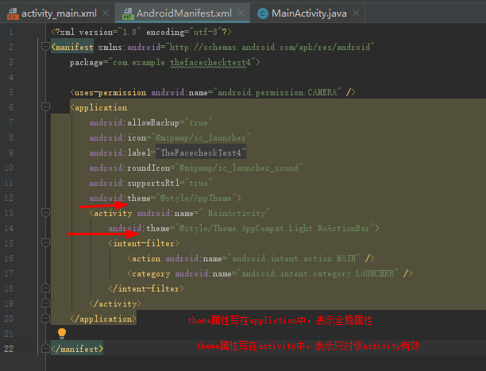
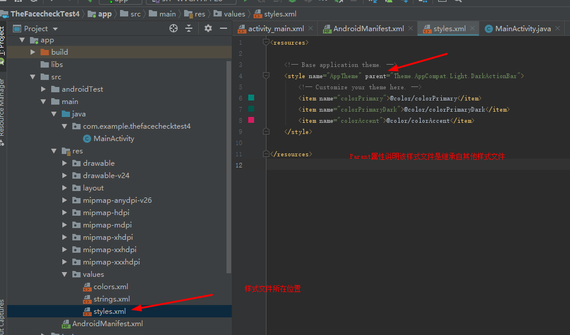
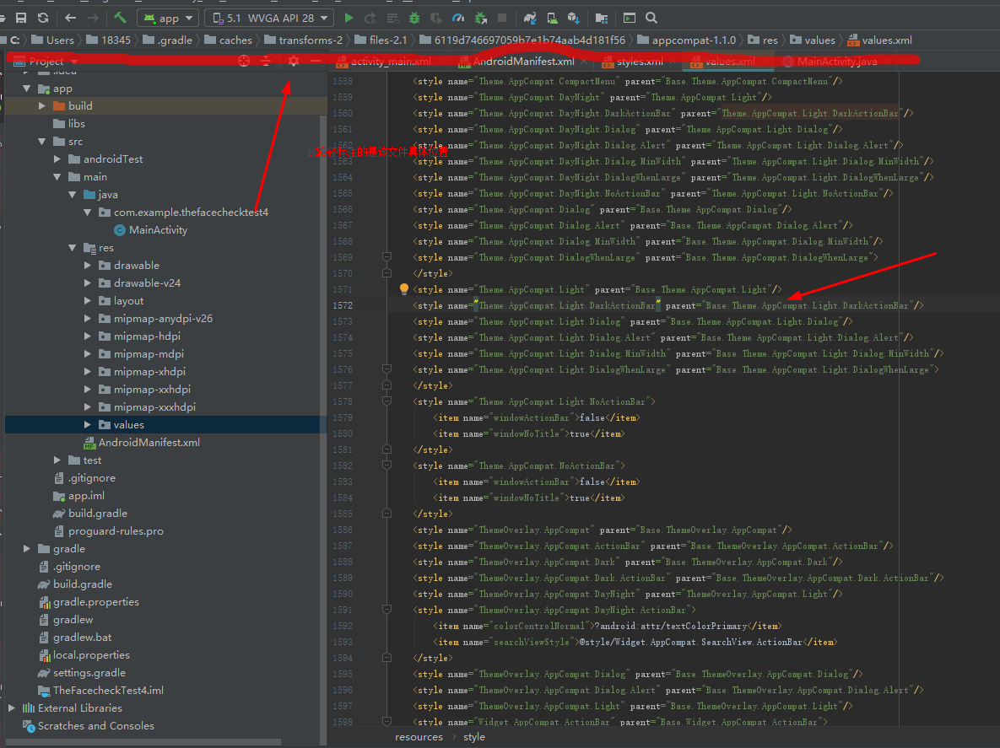
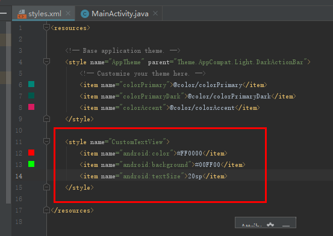
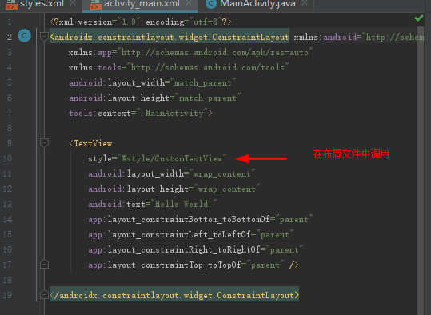
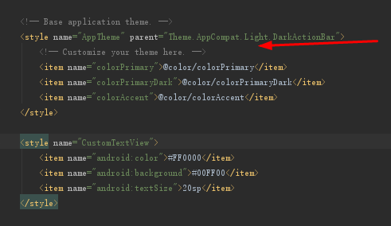
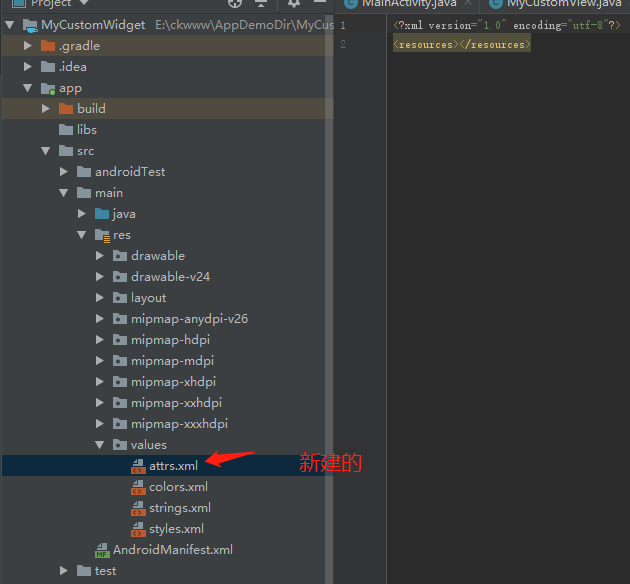
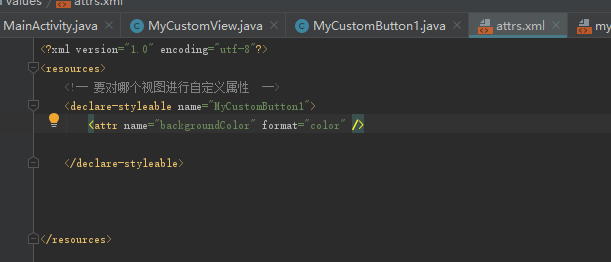
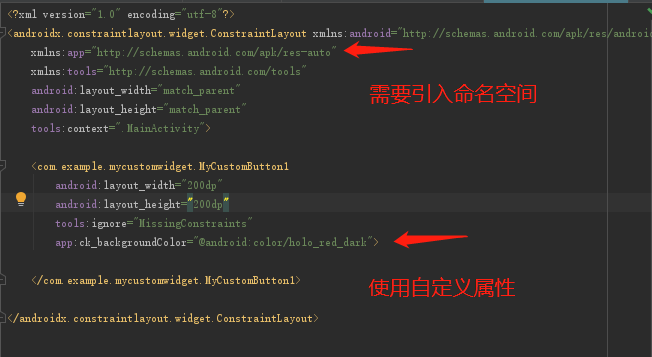

# 13_自定义控件
## 1)预备知识
### 1.了解dp,sp和px
   1)px:像素点
   2)dp:与像素密度密切相关  100px  200px
   3)sp: 相当于dp  用来修饰文字的
   4)dip:  = dp
    怎么用？
    *文字一律使用sp*
    *非文字一律使用dp*
    *偶尔需要使用px做单位，例如在屏幕上画一条分割线的时候*


### 2.Inflate的使用
#### 1.LayoutInflater是什么
在实际开发中LayoutInflater这个类还是非常有用的，它的作用类似于findViewById()。不同点是LayoutInflater是用来找res/layout/下的xml布局文件，并且实例化；而findViewById()是找xml布局文件下的具体widget控件(如Button、TextView等)。
具体作用：
1、对于一个没有被载入或者想要动态载入的界面，都需要使用LayoutInflater.inflate()来载入；
2、对于一个已经载入的界面，就可以使用Activiyt.findViewById()方法来获得其中的界面元素。
LayoutInflater 是一个抽象类，在文档中如下声明：
public abstract class LayoutInflater extends Object
获得 LayoutInflater 实例的三种方式
1. LayoutInflater inflater = getLayoutInflater();//调用Activity的getLayoutInflater() 
2. LayoutInflater inflater = LayoutInflater.from(context);  
3. LayoutInflater inflater =  (LayoutInflater)context.getSystemService
                              (Context.LAYOUT_INFLATER_SERVICE);
                              
#### 2.inflate怎么用
#### 3.相对于findViewById()
#### 获得LayoutInflater实例的三种方式
 1)getLayoutInflater()
 2)getSystemService(LAYOUT_INFLATER_SERVICE);
 3)LayoutInflater.from(context);

需要将一个xml文件转换为view视图时，需要用到inflate的一些方法

### 3.提取布局属性
1）Theme是针对窗体级别的，改变窗体样式；
2）Style是针对窗体元素级别的，改变指定控件或者Layout的样式



3）抽象view的共同属性



4）可继承
自定义样式可以继承其他的样式，通过 parent属性


## 2)自定义控件开始
### 1)View是如何工作的？


  （1）构造器-》初始化
  （2）onMeasure()  定大小
  （3）onLayout()   定位置
    (4)  onDraw()   绘制
    (5)  invalidate()  刷新

### 2)各主要方法源码

#### onMeasure()方法源码

```
@Override
	protected void onMeasure(int widthMeasureSpec, int heightMeasureSpec) {
		super.onMeasure(widthMeasureSpec, heightMeasureSpec);
	}
```
这里的widthMeasureSpec和heightMeasureSpec是由父容器传递过来的测量要求


  ```
  >     /**
  >      * <p>
  >      * Measure the view and its content to determine the measured width and the
  >      * measured height. This method is invoked by {@link #measure(int, int)} and
  >      * should be overridden by subclasses to provide accurate and efficient
  >      * measurement of their contents.
  >      * </p>
  >      *
  >      * <p>
  >      * <strong>CONTRACT:</strong> When overriding this method, you
  >      * <em>must</em> call {@link #setMeasuredDimension(int, int)} to store the
  >      * measured width and height of this view. Failure to do so will trigger an
  >      * <code>IllegalStateException</code>, thrown by
  >      * {@link #measure(int, int)}. Calling the superclass'
  >      * {@link #onMeasure(int, int)} is a valid use.
  >      * </p>
  >      *
  >      * <p>
  >      * The base class implementation of measure defaults to the background size,
  >      * unless a larger size is allowed by the MeasureSpec. Subclasses should
  >      * override {@link #onMeasure(int, int)} to provide better measurements of
  >      * their content.
  >      * </p>
  >      *
  >      * <p>
  >      * If this method is overridden, it is the subclass's responsibility to make
  >      * sure the measured height and width are at least the view's minimum height
  >      * and width ({@link #getSuggestedMinimumHeight()} and
  >      * {@link #getSuggestedMinimumWidth()}).
  >      * </p>
  >      *
  >      * @param widthMeasureSpec horizontal space requirements as imposed by the parent.
  >      *                         The requirements are encoded with
  >      *                         {@link android.view.View.MeasureSpec}.
  >      * @param heightMeasureSpec vertical space requirements as imposed by the parent.
  >      *                         The requirements are encoded with
  >      *                         {@link android.view.View.MeasureSpec}.
  >      *
  >      * @see #getMeasuredWidth()
  >      * @see #getMeasuredHeight()
  >      * @see #setMeasuredDimension(int, int)
  >      * @see #getSuggestedMinimumHeight()
  >      * @see #getSuggestedMinimumWidth()
  >      * @see android.view.View.MeasureSpec#getMode(int)
  >      * @see android.view.View.MeasureSpec#getSize(int)
  >      */
  >     protected void onMeasure(int widthMeasureSpec, int heightMeasureSpec) {
  >         setMeasuredDimension(getDefaultSize(getSuggestedMinimumWidth(), widthMeasureSpec),
  >                 getDefaultSize(getSuggestedMinimumHeight(), heightMeasureSpec));
  >     }
  ```
#### onLayout()源码
    
    ```
    /**
     * Called from layout when this view should
     * assign a size and position to each of its children.
     *
     * Derived classes with children should override
     * this method and call layout on each of
     * their children.
     * @param changed This is a new size or position for this view
     * @param left Left position, relative to parent
     * @param top Top position, relative to parent
     * @param right Right position, relative to parent
     * @param bottom Bottom position, relative to parent
     */
    protected void onLayout(boolean changed, int left, int top, int right, int bottom) {
    }

    ```
#### onDraw()源码

```
    /**
     * Implement this to do your drawing.
     *
     * @param canvas the canvas on which the background will be drawn
     */
    protected void onDraw(Canvas canvas) {
    }
```

#### onInvalidate()源码

```
   /**
     * Invalidate the whole view. If the view is visible,
     * {@link #onDraw(android.graphics.Canvas)} will be called at some point in
     * the future.
     * <p>
     * This must be called from a UI thread. To call from a non-UI thread, call
     * {@link #postInvalidate()}.
     */
    public void invalidate() {
        invalidate(true);
    }
```

### 3)自定义控件的三种主要形式
创建形式:
(1)继承已有的控件来实现自定义控件
(2)通过继承一个布局文件来实现自定义控件
(3)通过继承view类来实现自定义控件

### 4）案例1：
 (1)做一个圆形的红色按钮(2)中间有一个白色的数字（3）数字起始为20（4）每点击减少1
```
package com.example.mycustomwidget;

import android.content.Context;
import android.graphics.Canvas;
import android.graphics.Color;
import android.graphics.Paint;
import android.graphics.Rect;
import android.util.AttributeSet;
import android.view.View;
import androidx.annotation.Nullable;

/**
 * 1)做一个红色的按钮
 * 2）有一个白色的数字
 * 3）起始数字为20
 * 4）每点击一次减少1
 *
 */

public class MyCustomButton1 extends View implements View.OnClickListener {

    private Paint mPaint;
    private Rect mRect;
    private int mNum=30;

    public MyCustomButton1(Context context) {
        //这里是重点，相互调用构造器
        this(context,null);
    }
    public MyCustomButton1(Context context, @Nullable AttributeSet attrs) {
        this(context, attrs,0);
    }

    public MyCustomButton1(Context context, @Nullable AttributeSet attrs, int defStyleAttr) {
        super(context, attrs, defStyleAttr);

        initView();
    }
    /**
     * 初始化
     */
    public void initView(){

        mPaint = new Paint(Paint.ANTI_ALIAS_FLAG);  //相当于画笔
        mRect = new Rect();     //四边形
        this.setOnClickListener(this);

    }
    /**
     * 1）绘制
     * @param canvas
     */
    @Override
    protected void onDraw(Canvas canvas) {
        super.onDraw(canvas);

        mPaint.setColor(Color.RED);
        canvas.drawCircle(getWidth()/2,getHeight()/2,getWidth()/2,mPaint);

        mPaint.setColor(Color.WHITE);
        mPaint.setTextSize(60);
        String text = String.valueOf(mNum);
        //mRect是四周边距
        mPaint.getTextBounds(text,0,text.length(),mRect);  //将文字的范围大小放在mRect矩形上，可以通过mRect来获取文字范围

        int textWidth = mRect.width();
        int textHeight = mRect.height();
        canvas.drawText(text,getWidth()/2 - textWidth/2,getHeight()/2 + textHeight/2,mPaint);                  //绘制文字,居中

    }
    @Override
    public void onClick(View v) {
        if( mNum > 0 ){
            mNum--;
        }else{
            mNum = 30;
        }
        invalidate();     //刷新界面
    }
}

```

### 5）自定义视图属性
1)在哪里创建属性
2）可以创建哪些属性
3）如何使用这些属性
  (1)代码中引用
（2）布局中设置

#### （1）创建属性
在res > values 文件夹中新建一个attrs.xml文件


#### （2）使用属性

第一步:首先在自定义控件类中获取属性
TypedArray typedArray = context.obtainStyledAttributes(attrs,R.styleable.MyCustomButton1);  //获取自定义属性数组
mBackgroundColor = typedArray.getColor(R.styleable.MyCustomButton1_backgroundColor,Color.RED);  //获取单个自定义属性，如果没有获取到就返回设置的默认值

第二步:在布局文件中进行使用

引入自定义命名空间，这样才可以找到自定义属性
xmlns:app="http://schemas.android.com/apk/res-auto"


（1）context.obtainStyledAttributes(attrs,R.styleable.MyCustomButton1)

获取自定义属性数组
```
/**
     * Retrieve styled attribute information in this Context's theme.  See
     * {@link android.content.res.Resources.Theme#obtainStyledAttributes(AttributeSet, int[], int, int)}
     * for more information.
     *
     * @see android.content.res.Resources.Theme#obtainStyledAttributes(AttributeSet, int[], int, int)
     */
    @NonNull
    public final TypedArray obtainStyledAttributes(
            @Nullable AttributeSet set, @NonNull @StyleableRes int[] attrs) {
        return getTheme().obtainStyledAttributes(set, attrs, 0, 0);
    }
```
(2)typedArray.getColor(R.styleable.MyCustomButton1_backgroundColor,Color.RED); 
获取单个自定义属性

```
/**
     * Retrieve the color value for the attribute at <var>index</var>.  If
     * the attribute references a color resource holding a complex
     * {@link android.content.res.ColorStateList}, then the default color from
     * the set is returned.
     * <p>
     * This method will throw an exception if the attribute is defined but is
     * not an integer color or color state list.
     *
     * @param index Index of attribute to retrieve.
     * @param defValue Value to return if the attribute is not defined or
     *                 not a resource.
     *
     * @return Attribute color value, or defValue if not defined.
     * @throws RuntimeException if the TypedArray has already been recycled.
     * @throws UnsupportedOperationException if the attribute is defined but is
     *         not an integer color or color state list.
     */
    @ColorInt
    public int getColor(@StyleableRes int index, @ColorInt int defValue) {}
```


