### git笔记

#### 1.git介绍


#### 2.git安装


#### 3.本地库与远程库的交互方式

上图是本地库和远程库的交互方式，涉及到：
- 团队内部协作
- 跨团队协作

#### 4.git命令行操作
1) 初始化本地仓库
```
    git init
```

生成.git隐藏目录,初始化后的项目目录结构，不要删除，也不要随意修改

2）设置签名
用于区分不同的开发人员的身份
- 项目级别/仓库级别，仅在当前项目范围内有效
```
git config user.name tom
git config user.email goodlucktom@qq.com
```
- 系统用户级别：登陆当前操作系统的用户范围
```
git config --global user.name tom
git config --global user.email goodlucktom@qq.com
```
- 级别优先级
-- 就近原则：项目级别优先级由于系统用户级别，两者都有时采用项目级别的签名
-- 如果只有系统用户级别的签名，就以系统用户级别的签名为准
-- 二者都没有是不允许的

项目级别的签名信息被保存在当前项目下的.git目录下的config文件中

系统用户级别的签名信息保存位置：

在用户家目录下的.gitconfig文件中

3）查询状态
```
git status
```

默认在master分支上，上图表示没有任何提交，也没有什么可提交的

4）添加文件到暂存区
```
git add 
```


5)从暂存区删除文件
git rm --cache 文件名称

6）从暂存区提交到本地库
```
git commit -m "说明内容"
```

对文件进行修改编辑后，git可以检测出来，

7）查看提交的历史版本记录
```
git log
```
git log可以附加一些参数


```
git log --pretty=oneline         # 只显示一行

git log --online   # 只显示部分哈希值，并且只显示当前版本以及过去的版本

git reflog      #  显示对应修改版本的移动步数
```


所谓的历史版本记录，实际上是有个HEAD指针在帮助我们管理

版本穿梭的三种方式
1）基于索引值的操作    推荐
```
git reset --hard 哈希值 
```
这里只需要局部的索引值就可以了。
2）使用^符号
```
git reset --hard HEAD^
```
一个异或符号表示后退一步，多个异或符号表示后退n步
3）使用~符号
git reset --hard HEAD~n
其中n是几，就表示后退几个版本

第二和第三中方法都只能后退，无法前进

##### 获取git对应命令帮助
###### git help 命令

8)文件比较
```
git diff [文件名称]
 ```
 
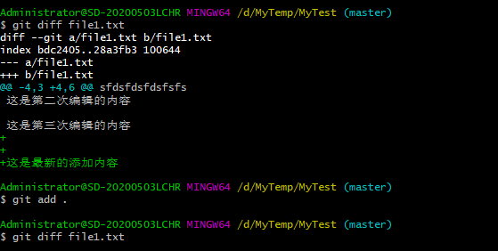

1） git diff 命令默认是工作区和暂存区进行比较
2） git diff HEAD [文件名称] 是工作区和本地库进行比较
3）也可以和历史版本进行比较，例如：
      git diff HEAD^ [文件名称]
      表示和上个版本的文件进行比较

9）分支管理
（1）什么是分支？
在控制版本过程中，使用多条线同时推进多个任务。
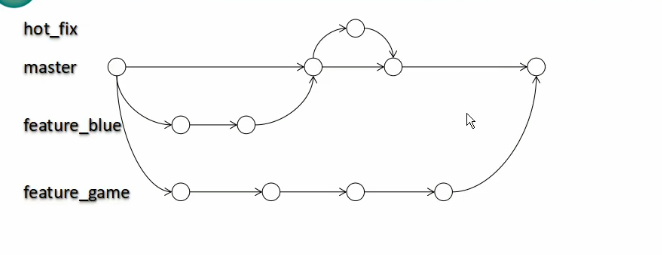
（2）分支的好处
- 同时并行推进多个开发功能，提高开发效率
- 各个分支在开发过程中，如果某一个分支开发失败，不会对其他分支有任何影响，失败的分支删除重新开始即可。

```
#1.创建分支
git branch [分支名]

#2.查看分支
git branch -v

#3.切换分支
git checkout [分支名称]

#4.合并分支
#1）切换到接受修改的分支（被合并，添加新内容）上
#2）执行merge命令
git merge [分支名称]
```


#####如何解决合并的冲突？
#####四个字：手动解决

冲突的解决：
（1）编辑文件，删除特殊符号
 (2)把文件修改到满意的程度，保存退出
（3）git add [文件名]
 (4)git commit -m "日志信息"

#### Hash算法简介

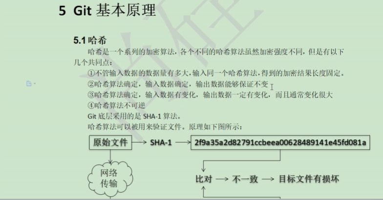

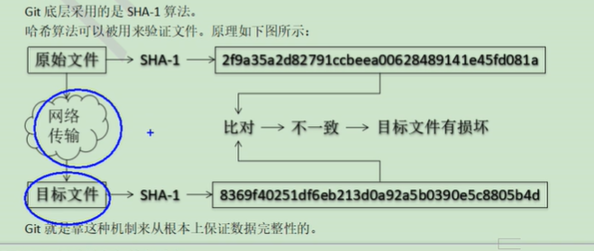

文件的hash值是用来提供校验文件用的

------------------请从底部开始看-------------
#### 笔记总结
1.状态查看操作    
           查看工作区,暂存区状态      git status
2.添加操作  
           将工作区的"新建/修改"添加到暂存区      git add [file name]
3.提交操作  
           将暂存区的内容提交到本地库                git commit -m "说明内容" [file name]
4.从暂存区删除文件  
            git rm --cache [file name]
5.显示历史版本记录
-            git log          显示完全的信息
-            git log --pretty=oneline          只显示 一行信息
-            git log --oneline                     只显示部分哈希值

-            git reflog             显示移动到对应版本需要移动的步数
            注意：多屏显示控制方式:
                      空格     向下翻页
                      b         向上翻页
                      q         推出
6.版本穿梭操作
1）可以穿梭到任意版本
       git reset --hard 索引值
2）只可以向前穿梭
        git reset --hard HEAD^
        其中如果有多个异或符号，表示向前回退多少个版本 
3）只可以向前穿梭
      git reset --hard HEAD~n
      n是多少，表示向前回退多少个版本

6.1 reset的三个参数对比
(1)  --soft参数
         仅仅在本地库移动HEAD指针
           
(2)  --mixed 参数
         在本地库移动指针
         重置暂存区
         
(3) --hard参数
        在本地库移动HEAD指针
        重置暂存区
        重置工作区

***因为git记录了所有的提交记录，所以可以通过版本穿梭的方式，找回被永久删除的文件*****
7.删除文件找回
```
git reset --hard [指针位置]   
```
删除操作已经提交到本地库：指针位置指向历史记录
删除操作尚未提交到本地库：指针位置使用 HEAD
前提：删除前，文件存在时的状态提交到了本地库
8.比较文件差异
1）git diff [文件名称]
将工作区中的文件和暂存区中的文件进行比较
2）git diff HEAD [文件名称]
将工作区中的文件和本地库的文件进行比较
3) git diff HEAD~n [文件名称]
也可以将工作区的文件和历史版本中的某个文件进行比较
4）git diff
不加文件名称，表示比较所有文件的变化


#### Git版本数据管理机制

#### Git文件管理机制细节

提交对象及其对象形成的链条


#### Git分支管理的本质是创建和移动指针

分支的切换


#### Github账号注册

#### 本地库与远程库的交互方式回顾


##### 步骤1.创建本地库

##### 步骤2.创建远程库

点击Create repository按钮，就创建成功了

##### 步骤3.在本地创建远程库地址别名

远程库地址如下:    https://github.com/ckgithub1205/mygittest3.git
***这个时候，可以将本地库推送到远程库中，但是由于远程库地址太长了，所以可以设置别名!***

查看远程地址的别名
```
git remote -v
```

给远程库设置别名
```
git remote add origin  https://github.com/ckgithub1205/mygittest3.git
```
其中,origin就代表后面的远程库的地址！

fetch表示该条地址用来取回
push表示该条地址用来推送

##### 步骤4.推送操作

```
git push [远程库地址别名] [分支名称]        #例如：  git push origin master
```


##### 步骤5.克隆操作
克隆操作多用于其他人从远程库中拷贝代码到本地

克隆的几个作用
1.完整的把远程库下载到本地
2.创建origin远程地址别名
3.初始化本地库

##### 步骤6.邀请其他成员加入
其他人在没有接收到邀请之前，是无法直接push代码到远程库的。可以通过邀请他人的方式


复制邀请链接

被邀请人访问发送的邀请链接，点击接受，即可邀请成功！

变成团队成员以后，可以向远程库提交代码

提交到github，只是第一次需要输入账号密码进行验证，因为win10的凭证管理器记住了账号密码

如果用其他账号提交到远程库，可以删掉该凭证
###### 7.远程库修改的拉取

拉取:
pull = fetch + marge
```
git fetch [远程库地址别名/分支名称]
git marge [远程地址别名/分支名称]
```
或者直接使用pull进行推送
```
git pull [远程库地址别名] [分支名称]        # 如， git pull origin master
```

##### 步骤7.协同开发时冲突的解决
问题:为什么不是最新版，就无法接受推送？
答：如果不是基于Github的最新版所作的修改，不能推送，必须先拉取。
     拉取下拉后如果进入冲突状态，则按照“分支冲突解决”操作解决即可。

#### 跨团队协作操作演示
##### Fork指令操作
跨团队操作是通过fork命令，相当于将代码库重新拷贝了一份到另一团队的仓库中
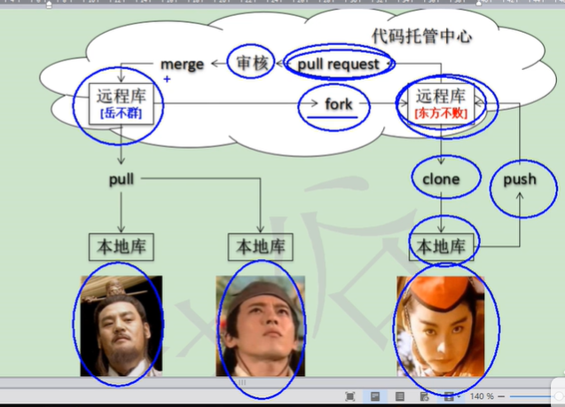
具体操作：
(1)复制自己版本库的链接地址
(2)发送给要合作方
(3)合作方用自己的身份登陆，然后点击fork按钮
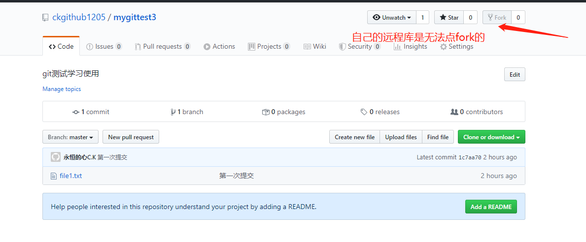
点击fork按钮之后，会自动复制一份到当前github账户下。
##### pull request请求
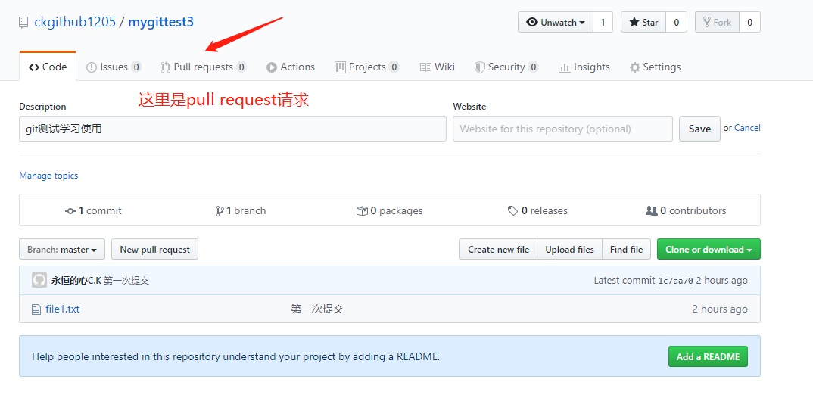
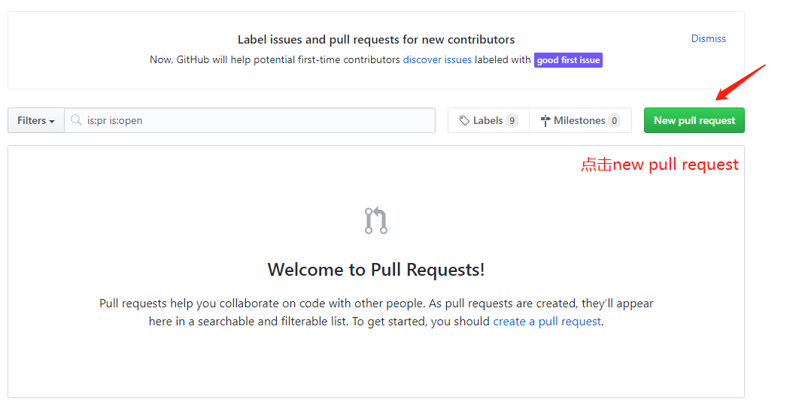
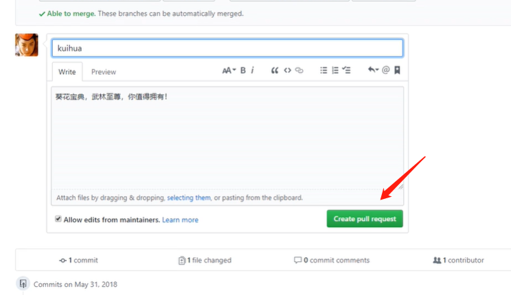
接收方同样也需要接收下才可以
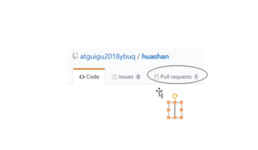
点击pull requests来更新更新代码
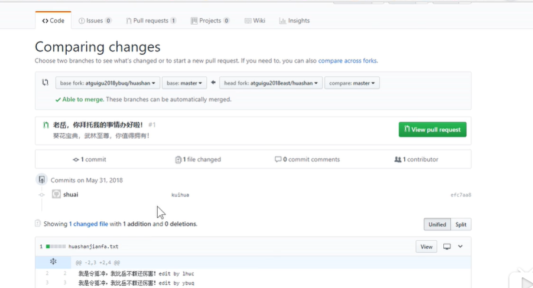
这里显示提交的代码
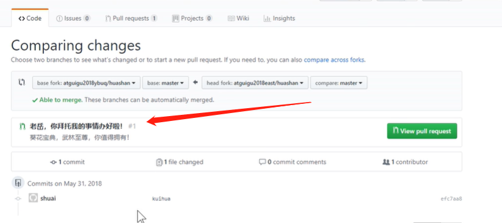

可以隔空进行对话
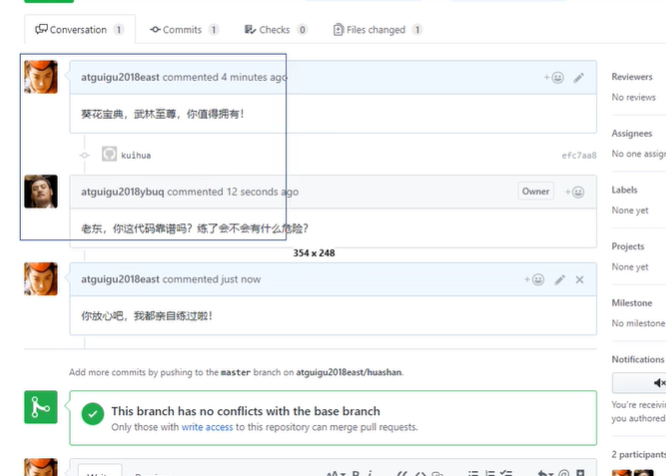
审核代码
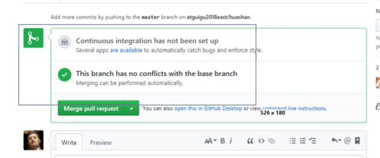
在最底部有个合并代码的按钮，点击后就可以合并了。。。。

##### 步骤8.SSH免密登陆


##### Git中忽略文件配置
忽略文件的原则
- 忽略操作系统自动生成的文件，比如缩略图等
- 忽略编译生成的中间文件，可执行文件等，就是如果一个文件是由另一个文件生成的，那么就没有必要放进版本库中
- 忽略带有敏感信息的配置文件

使用方法
1. 在工作区新建一个名称为.gitignore的文件
2. 把要忽略的文件名称填进去，git会自动忽略这些文件

忽略规则文件语法
a.忽略指定文件/目录
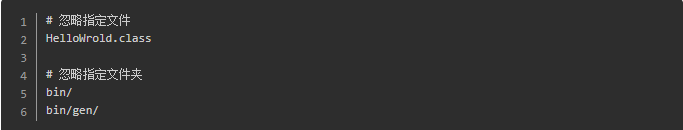
b.通配符忽略规格
通配符规则如下：


#### Git工作流
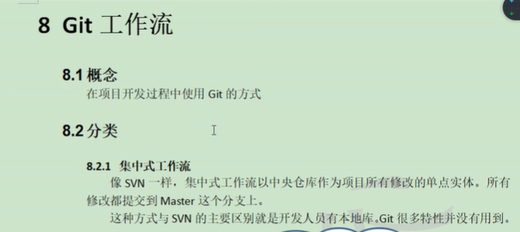
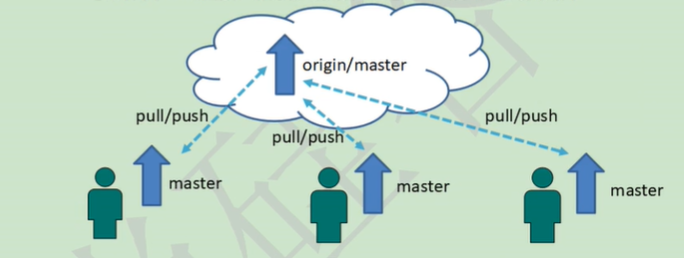
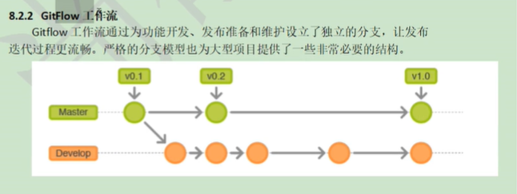
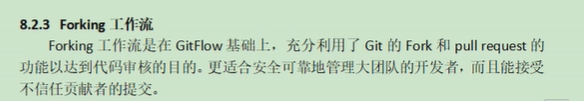
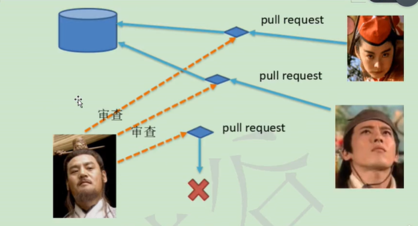

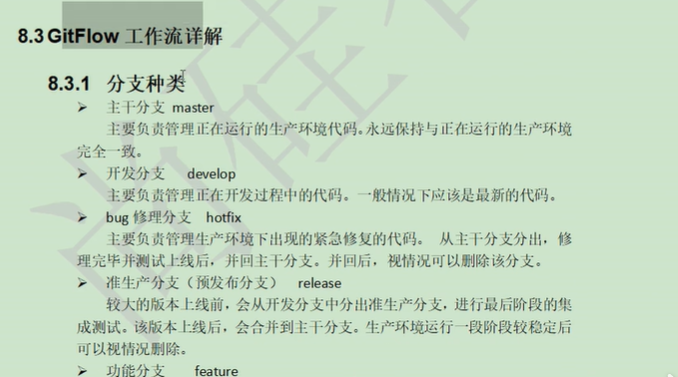
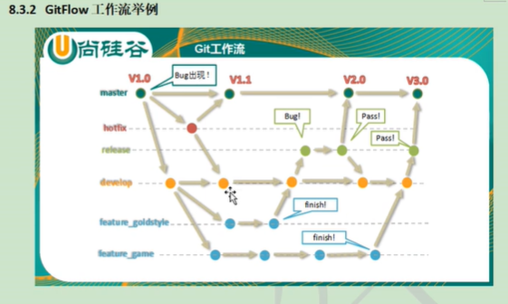
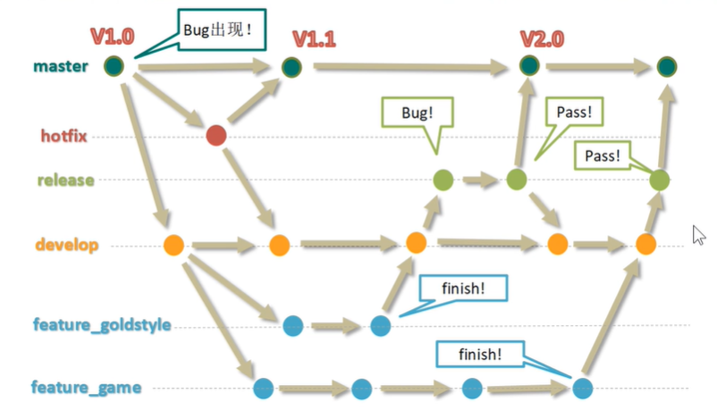