# MongoDb数据库命令行操作指令

参考文档    https://www.yiibai.com/mongodb
## 1.数据库操作
### 1.查看有哪些数据库
```
show dbs
```
新安装完成后，只有三个默认的数据库：   admin     config     local

### 2.使用数据库,创建数据库
```
use [数据库名称]
```
该条指令会切换到指定数据库，如果数据库不存在，就会创建数据库

### 3.删除数据库,删除当前所在数据库
需要先切换到数据，然后再执行删除操作
```
use itcktest              #切换到itcktest数据库

db.dropDatabase()         #删除当前数据库
```


## 2.集合操作

### 3.向数据库的集合中插入数据
```
db.user.insert({"username":"chenk","passwd":"123456"})
```
表示向数据库的user集合中插入数据，如果该集合不存在就自动创建

### 4.查询指定数据库中有哪些集合
```
show collections
```

### 5.查看集合中有哪些数据
```
db.user.find()
```
是查询当前集合中所有的数据
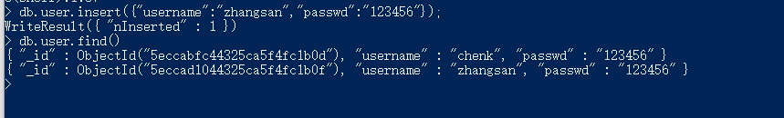

### 6.删除指定集合
```
db.user.drop()
```
该指令表示删除user这个集合


### 3.数据的操作
#### 1.查询数据
```
db.user.find(params)
```
根据参数查询数据，params为key-value键值对
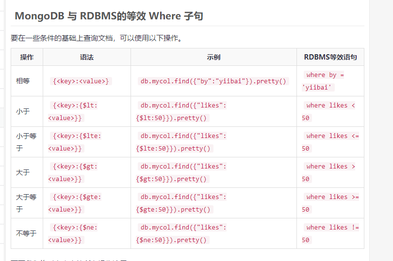
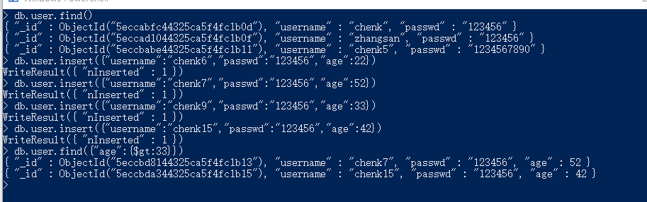
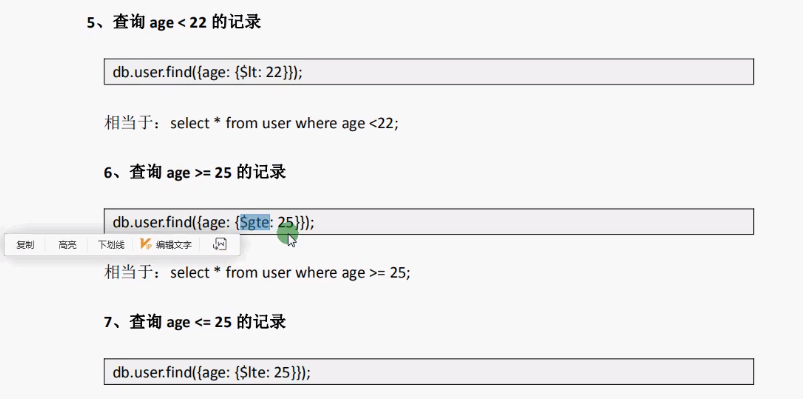

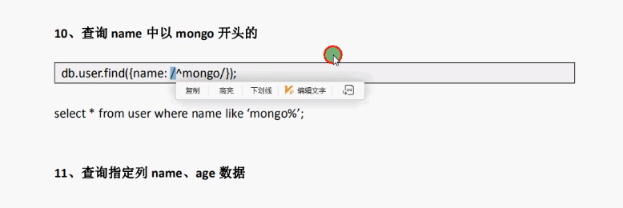
查找指定列的数据
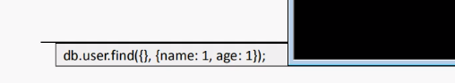
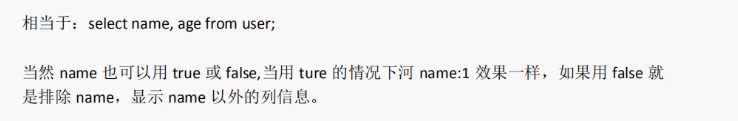

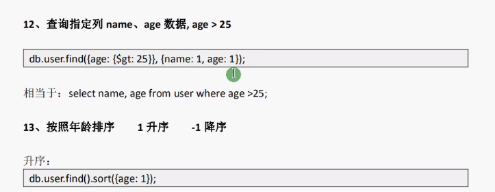
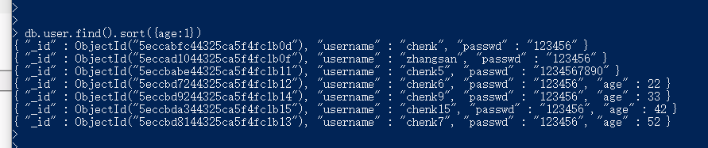

其中，1表示正序，-1表示倒序

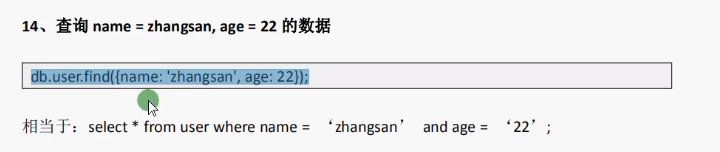
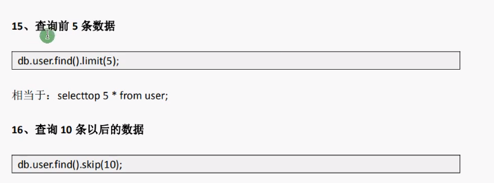
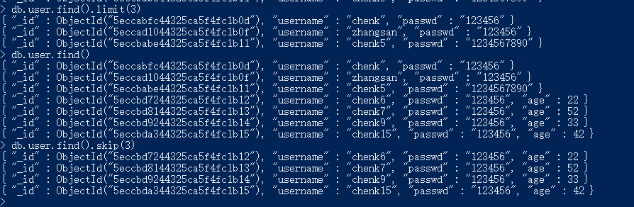
查看集合中有多少条数据（统计数量）
```
db.user.find().count()
```
表示查询user集合中有多少条数据
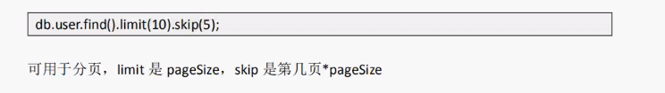

上面的分页公式写错了
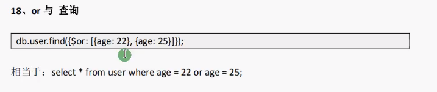
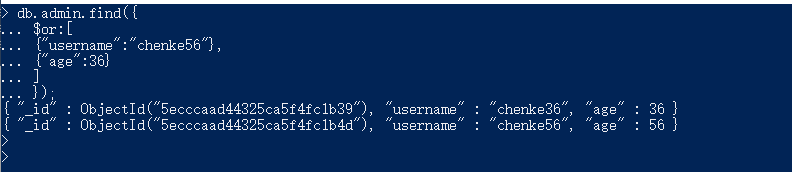


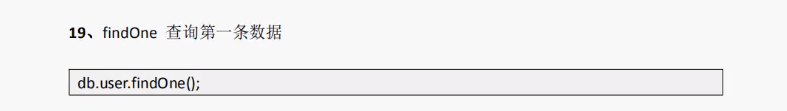


## 3.数据修改
### 1.数据更新
```
db.COLLECTION_NAME.update(SELECTION_CRITERIA, UPDATED_DATA)
```
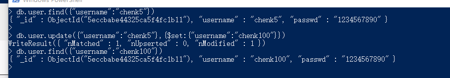

默认情况下，MongoDB只会更新一个文档。要更新多个文档，需要将参数’multi‘设置为true。
```
db.mycol.update({'title':'MongoDB Overview'},
   {$set:{'title':'New Update MongoDB Overview'}},{multi:true})
```


### 2.数据删除
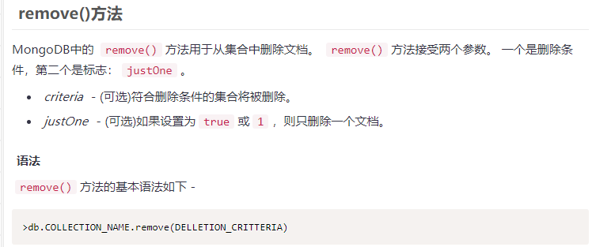
```
db.user.remove({"username":"chenke35"})
```
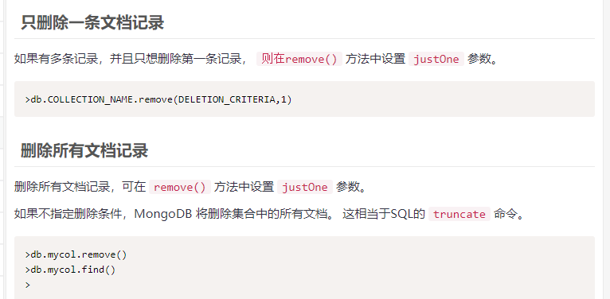

## 4.MongoDb大数据查询优化，MongoDb索引，复合索引，唯一索引，explain分析查询速度

### 1.索引基础
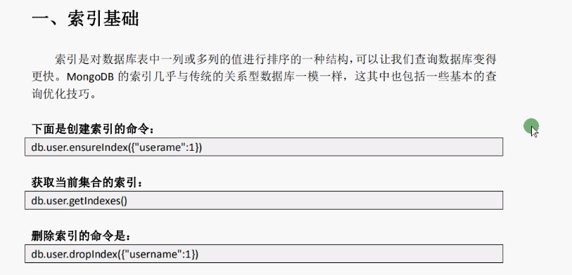
#### 1.创建索引
```
db.user.ensureIndex({"username":1})
```
该条命令表示给user集合的username属性设置索引，为升序排序
#### 2.获取当前集合的索引
```
db.user.getIndexes()
```
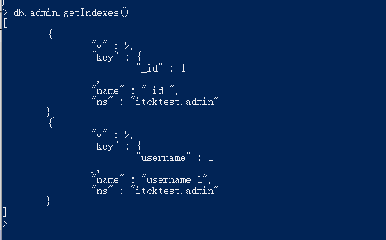
#### 3.删除索引命令
```
db.user.dropIndex({"username":1})
```


#### 分析查询
```
db.admin.find().explain();
db.admin.find().exxplain("executionStats");    #这条指令返回的分析信息中包含executionStats属性
```
分析查询性能
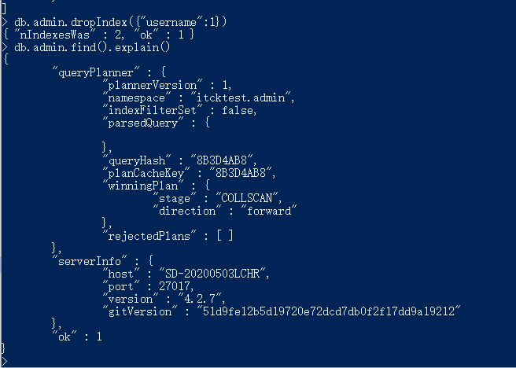

#### 4.复合索引
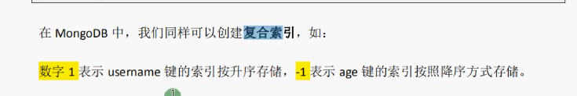
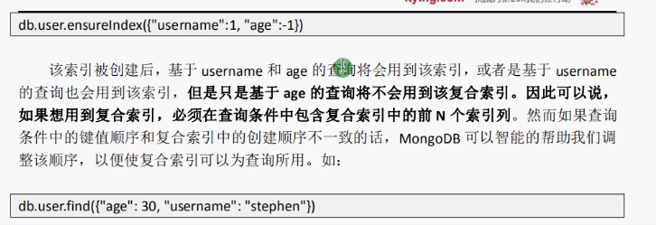
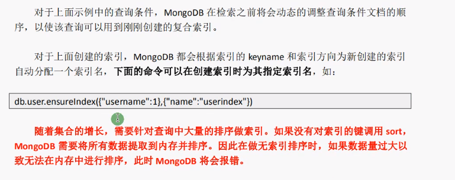

### 2.唯一索引
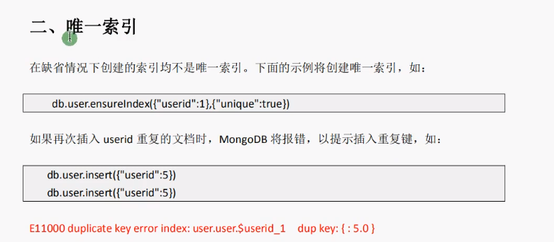
唯一索引的值不能重复！

## 5.MongoDb的权限验证
### 1.MongoDb账户权限配置
- 1).创建超级管理员
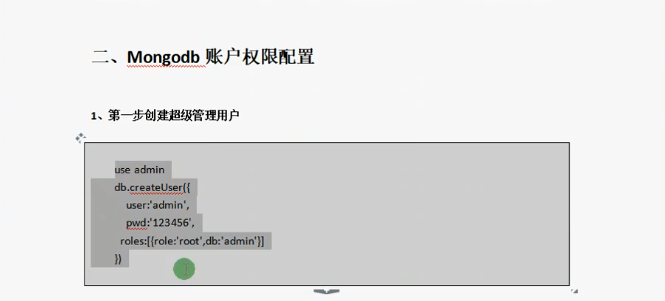
2)修改Mongodb数据库配置文件
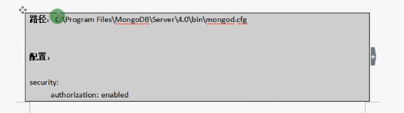
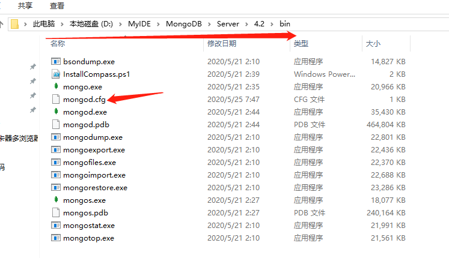
在我本机中的路径如上所示

