# nodejs教程_2020年最新NodeJs教程_nodejs+mongodb零基础入门实战教程
播放地址   https://www.bilibili.com/video/BV16f4y1U7oT?from=search&seid=10046859123817769849

## 1.Nodejs之Http模块 URL模块
例子
```
//表示引入http模块
var http = require('http');

/**
 * request 获取url传递过来的信息
 * response 给浏览器响应信息
 */
http.createServer(function (request, response) {

  //设置响应头
  response.writeHead(200, {'Content-Type': 'text/plain'});
  //表示在页面输出，并结束
  response.end('Hello World');

  //监听的端口是8081
}).listen(8081);

console.log('Server running at http://127.0.0.1:8081/');
```
```
var http = require('http');

http.createServer((req,res)=>{

    //获取url
    console.log(req.url);

    //设置响应头，状态码200，字符编码utf-8
    res.writeHead(200,{"Content-Type":"text/html;charset='utf-8"});

    res.write("<head><meta charset='utf-8' /></head>");
    //如果输入的是中文,会乱码，必须要在hmtl中指明编码，加上上面一行代码
    res.write("你好,nodejs");

    //结束响应
    res.end();


    //监听8081端口
}).listen(8081);
```

### 1.url模块的使用
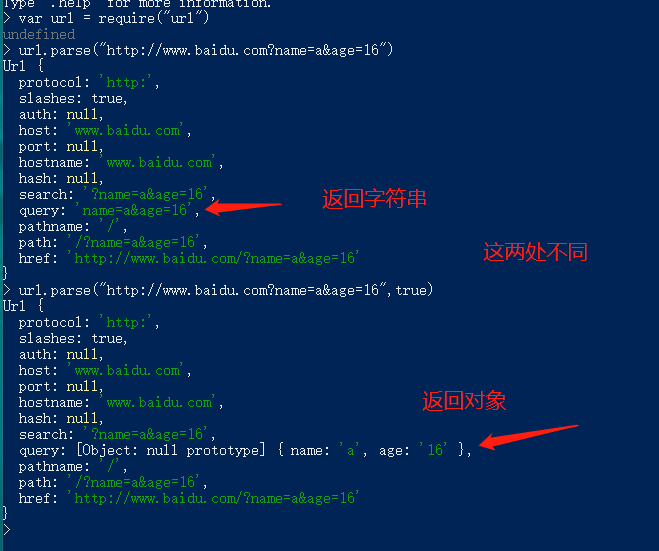
***url.parse()***
第一个参数是url字符串地址，
第二个参数可选  true: 其中的query返回的是一个对象，false:其中的query返回的是字符串
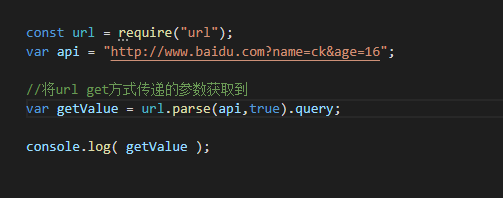
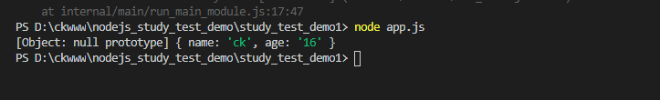

- 综合案例：获取地址栏参数
```
const http = require('http');
const url = require("url");

http.createServer((req,res)=>{

    if(req.url != '/favicon.ico'){
        //获取url地址兰参数
        console.log(url.parse(req.url,true).query);
    }

    //设置响应头，状态码200，字符编码utf-8
    res.writeHead(200,{"Content-Type":"text/html;charset='utf-8"});

    res.write("<head><meta charset='utf-8' /></head>");
    //如果输入的是中文,会乱码，必须要在hmtl中指明编码，加上上面一行代码
    res.write("你好,nodejs");

    //结束响应
    res.end();


    //监听8081端口
}).listen(8081);

```

## 2.supervisor工具的使用
主要用于自启动，可以自动监听代码内容是否改变

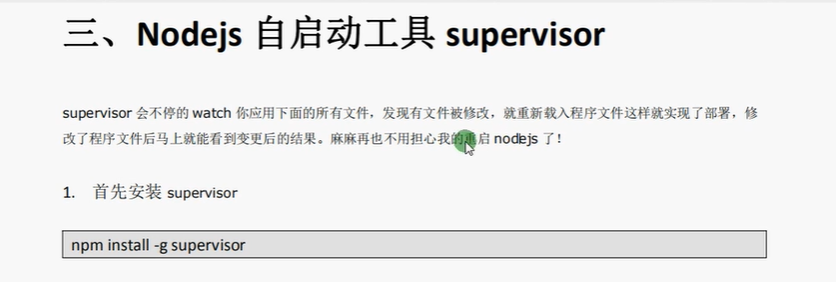
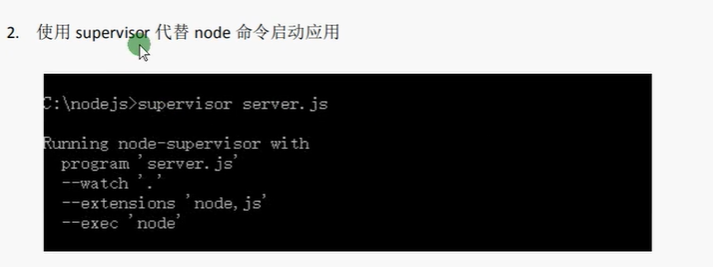

1.安装supervisor

npm install -g supervisor
2.使用supervisor代替node命令启动应用

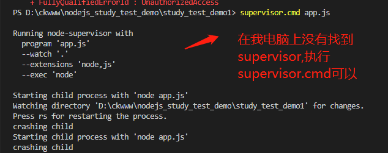

如果安装失败，可以使用`cnpm`来进行安装！

## 3.commonJs和Nodejs模块,自定义模块

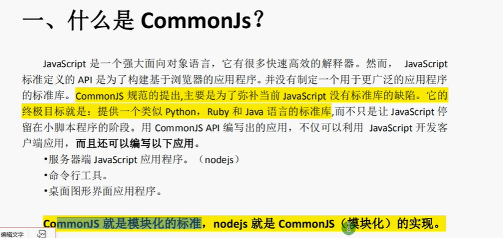

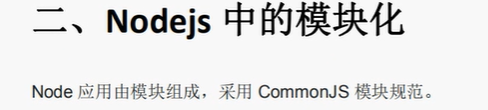

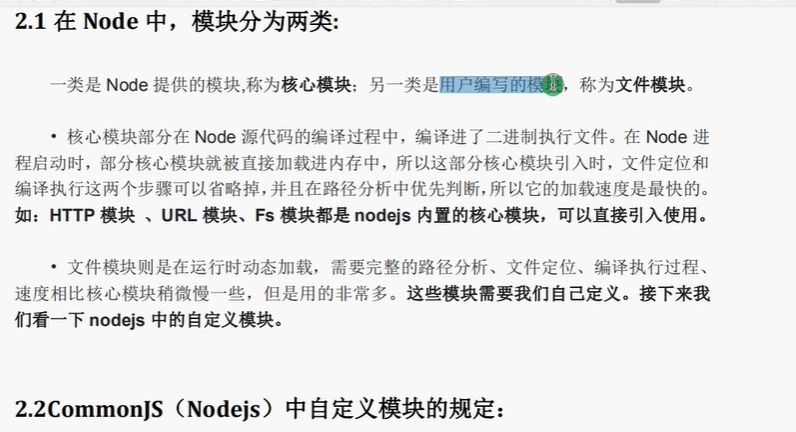

在NodeJs中，模块分为两类：
一种是nodejs提供的模块，称为**核心模块**；另一类是用户编写的模块，成为**文件模块**。

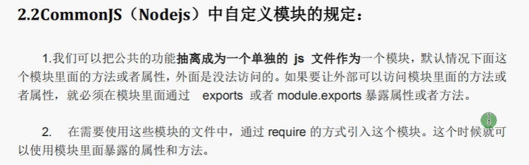

1.自定义的模块，外部是无法访问的，必须在模块里面通过exports 或者 module.exports 来暴露属性或者方法。
2.通过require的方式来引入使用的模块

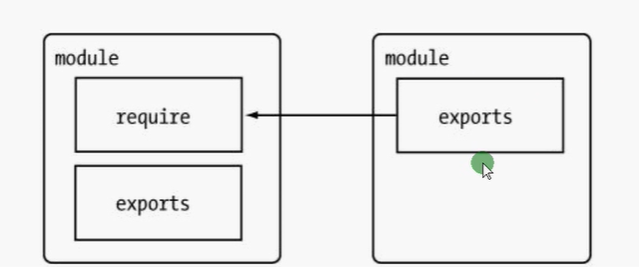

将自定义模块暴露出来的两种方式：
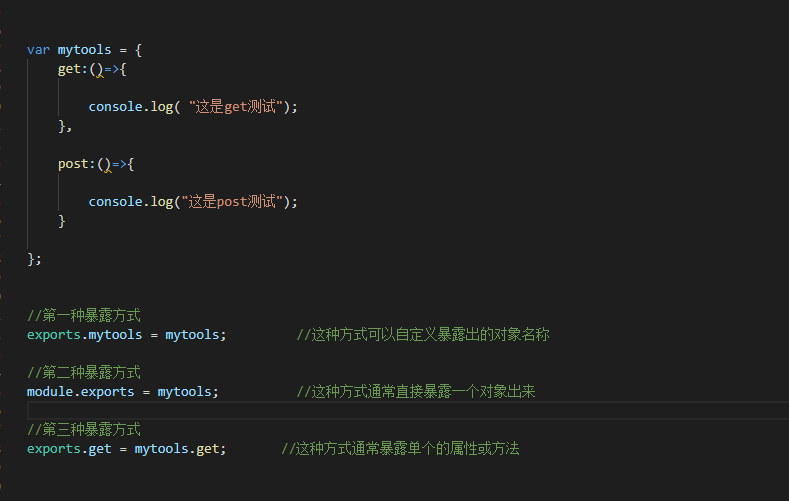
使用require方式引入使用
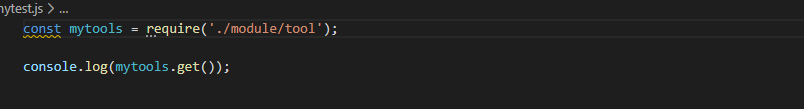
### 提醒：自定义模块导入报错的可能问题？
当直接通过require("模块名称")的方式引入时，默认会直接在当前项目node_module下寻找对应模块目录下的index.js文件,如果找不到index.js文件就会报错，
提示找不到该模块！
**如何解决？？？？**
如果不想命名为index.js文件，就想使用与模块同名的文件，可以在当前模块下操作命令行

npm init
生成package.json文件即可


## 4.Nodejs中的包，npm，第三方模块,package.json以及cnpm

### 1.包的介绍

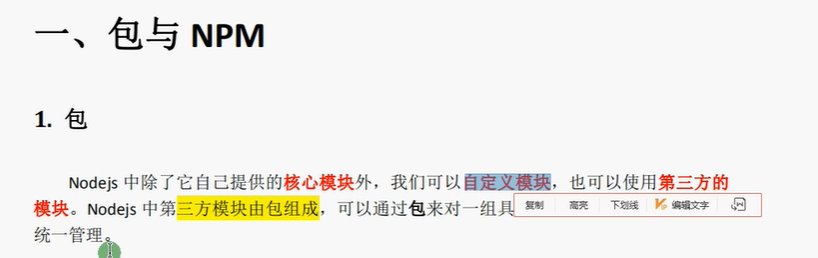

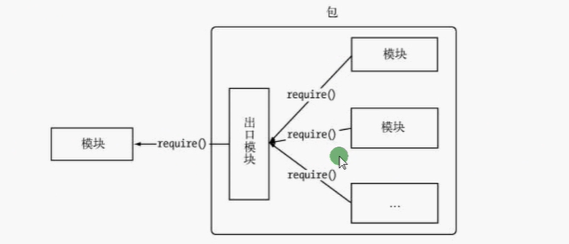

### 2.包的目录规范
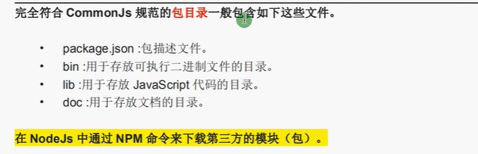

完全符合CommonJS规范的包目录一般包含如下这些文件：
- package.json:   包描述文件
- bin:用于存放可执行二进制文件的目录
- lib：用于存放javascript代码的目录
- doc:用于存放文档的目录

### 3.npm介绍

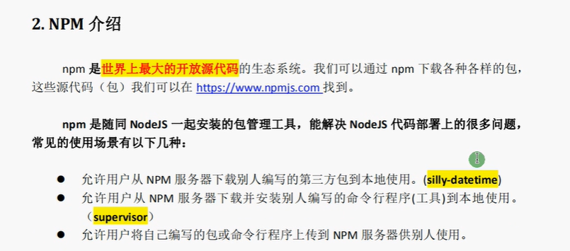

最大的开放源代码的生态系统:
https://www.npmjs.com/
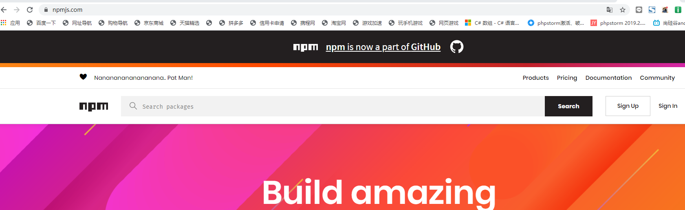

示例：演示md5包的使用


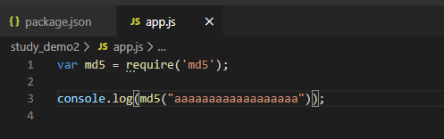
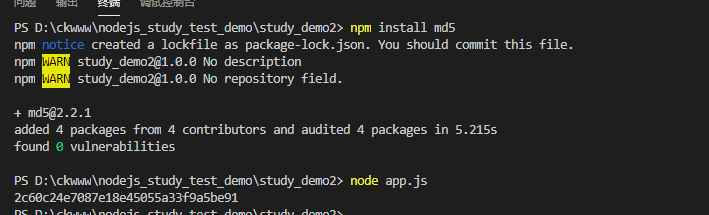

### 4.npm install与npm install --save的区别
- npm install 包名称           执行后是不会将依赖包写入到package.json中的
- npm install --save 包名称     执行后会将依赖包名写入到package.json中

发送给别人使用时，是不会发送node_module这个文件夹的
运行npm install,就会自动安装对应所需的依赖


### 5.silly-datetime包的演示(格式化日期)
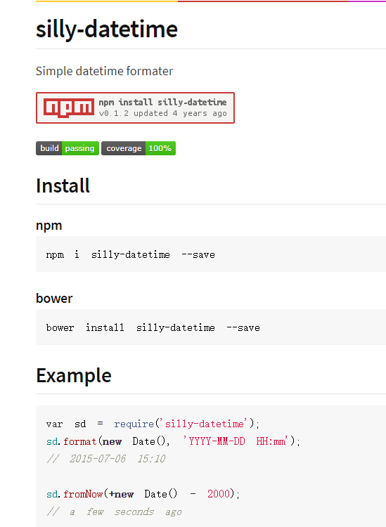

### 6.npm相关命令

1.查看npm版本
```
npm -v
```
2.npm安装模块
```
npm install 模块名称 --sava      #--save会将依赖添加到package.json中
```
3.npm卸载模块
```
npm uninstall 模块名称
```
4.查看当前目录下已安装的node包
```
node list
```
5.查看模块信息
```
npm info 模块名称
```
6.指定版本安装，例如：
```
npm install jquery@1.8.0
```

### 7.package.json文件介绍
pacakge.json定义了项目所需的各种模块以及项目的配置信息(比如名称，版本，许可证等元数据)
1.创建package.json文件
```
npm init  获取  npm init --yes
```
2.package.json文件
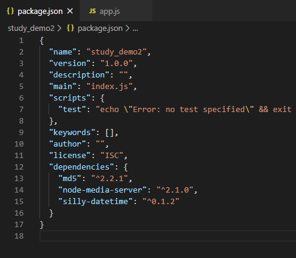
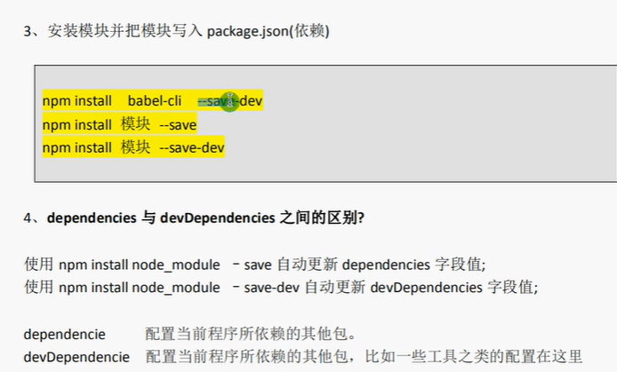
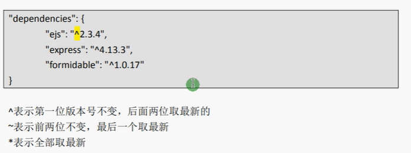

## 5.NodeJs的fs模块
### 1.文件相关常用方法
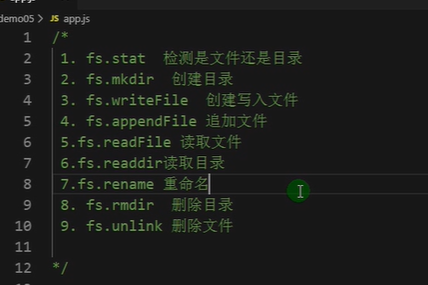
```

const fs = require('fs');
const path = require('path');
//此处./html是目录
//检测是否是文件，是否是目录
fs.stat('./html',(err,res)=>{
    if(err){
        console.log(err);
        return;
    }
    console.log(`是文件:${res.isFile()}`);      //是文件：false
    console.log(`是文件夹:${res.isDirectory()}`);    //是文件夹:true
});
/**
 * 创建文件夹，如果已经存在就会报错
 * @param path   将要创建的目录路径
 * @param mode   目录权限(读写权限),默认777
 * @param callback 回调,传递异常参数
 * 
 * */
fs.mkdir('./css',(err)=>{
    if(err){
        console.log(err);
        return;
    }
    console.log("创建成功");
});
//如果文件不存在，就创建文件并写入内容
//如果文件存在，就替换文件内容
fs.writeFile('./html/index.html',"你好,nodejs1111",(err)=>{
    if(err){
        console.log(err);return;
    }
    console.log("创建写入文件成功");
});

/**
 * 追加内容
 */
fs.appendFile('./html/index2.html',"这是追加的内容",(err)=>{
    if(err){
        console.log(err)
    }

    console.log('追加文件内容成功!');
});
/**
 * 读取文件内容
 */
fs.readFile("./html/content.html",'utf-8',(err,data)=>{

    if(err){
        console.log(err);return;
    }
    console.log( data );
});

let filepath = './html';
//读取文件夹
fs.readdir(filepath,(err,files)=>{

    if(err){
        throw err;
    }
    files.forEach(pt => {

        let p = path.join(filepath,pt);   //拼接为绝对路径
        fs.stat(p,(err,stats)=>{
            if(err){
                console.log(err);return;
            }
            const result = stats.isDirectory()?`${p}是文件夹`:(stats.isFile()?`${p}是文件`:`${p}是未知文件类型`);
            console.log( result );

        });
    });
});

//重命名，也可以执行移动操作
//如果新路径与旧路径不在同级目录下，就是移动操作
fs.rename('./html/css/style.css','./html/css/css.css',(err)=>{

    if(err){
        console.log( err);
        return;
    }
    console.log('重命名成功!');
});

/**
 * 删除目录操作,只可以删除空目录，否则报错
 */
fs.rmdir('./mytestabc',(err)=>{
    if(err){
        console.log(err);return;
    }
    console.log("目录成功！");
});

//删除文件
fs.unlink('./mytestabc',(err)=>{
    if(err){
        console.log(err);
    }
    console.log('删除文件成功');
});

```

### 2.mkdirp模块使用示例
mkdir模块是文件管理相关的模块，可以递归创建层级目录，功能比较强大。

## 6.Node的新特性 async,await


ES6常见语法的使用
- let, const
- 箭头函数
- 对象，属性的简写
- 模板字符串
- Promise

(1)let,const都是一个块作用域， const定义的对象值不可以改变
(2)模板字符串：

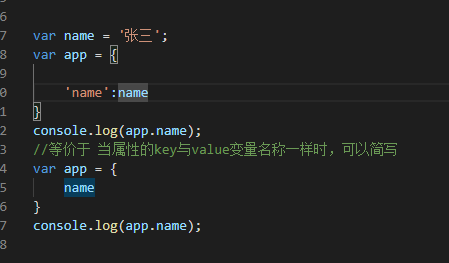
方法的简写
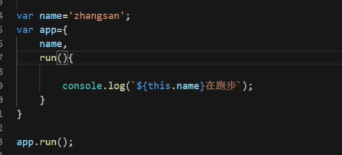
箭头函数的使用
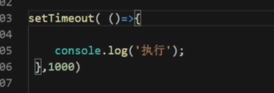
外部获取异步方法中的数据
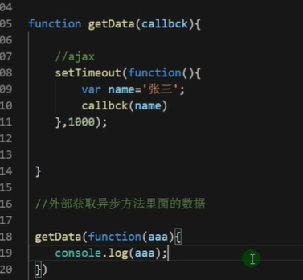
***这个获取异步方法中数据的方法，是在ES6没有出来之前使用的
ES6出来之后，可以使用async,await关键字实现***

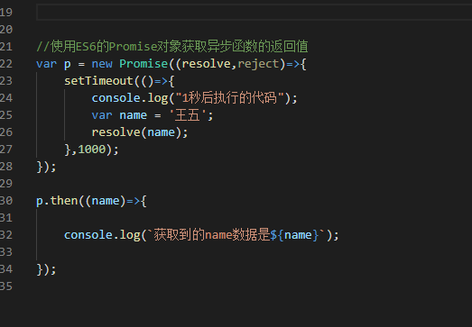
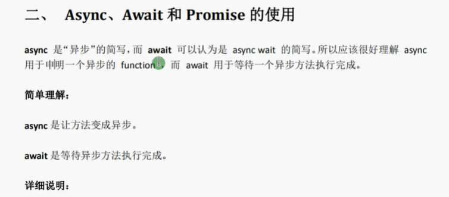
注意点：
- async属性用来定义方法，表示该方法是个异步函数
- await必须用在异步方法中，可以等待异步方法执行完毕后再返回结果，如果不用在异步方法中直接调用会报错

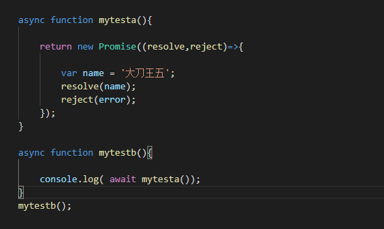

## 7.文件流的使用

### 1.读取流   fs.readStream
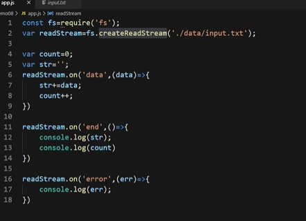
### 2.写入流的使用
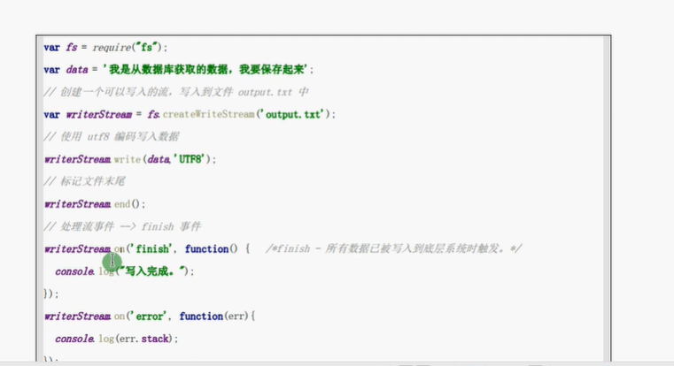
使用写入流注意点：
如果不写writeStream.end()方法，将不会触发监听的finish事件，虽然也可以完成！
writeStream.write()方法不可以递归创建目录，如果写入的文件上级目录不存在后报错！
### 3.管道流的使用
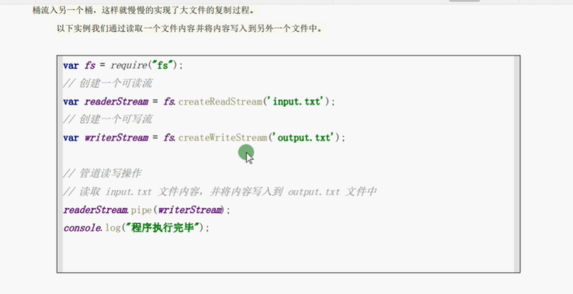
管道流的使用：主要用于复制文件
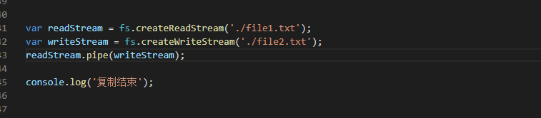
将读取流输送到写入流中！


## NodeJS创建静态服务器
### 其中：demo10是通过原生NodeJS创建的静态服务器

### demo11是对demo10的进一步封装


### ejs模块引擎
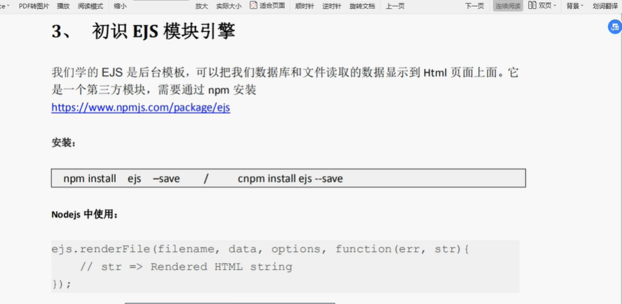
### Get和Post请求


## 使用NodeJs封装一个类似express的框架


## MongoDb数据库的介绍
官方网址   https://www.mongodb.com

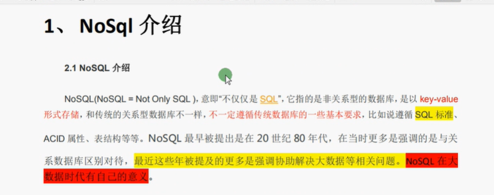
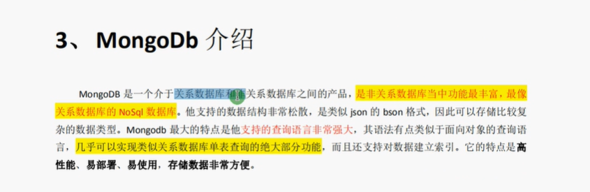

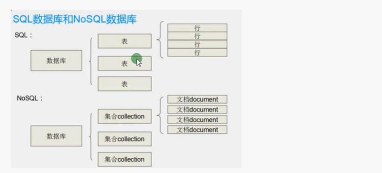

### 1.查看已经存在的数据库
```
show dbs
```
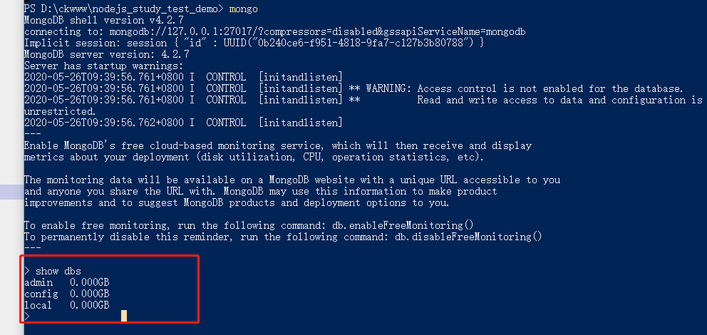
新安装完成后，只有三个默认的数据库：   admin     config     local        
假设创建如下数据库：
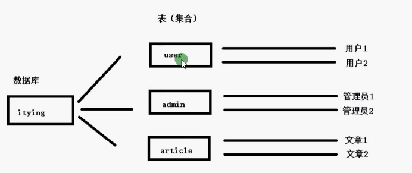
### 3.向数据库中插入数据
```
db.users.insert({"username":"chenk","passwd":"123456"})
```
表示向数据库的user集合中插入数据，如果集合不存在就自动创建

