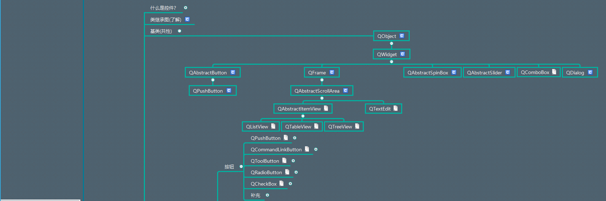
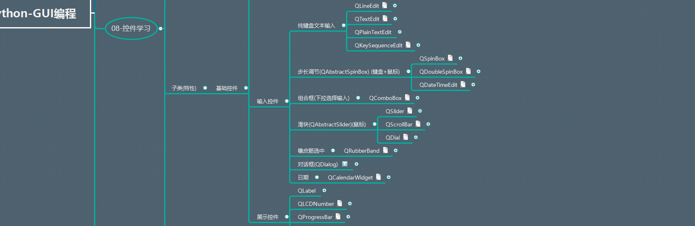
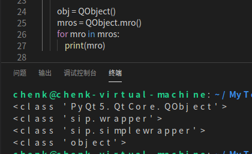
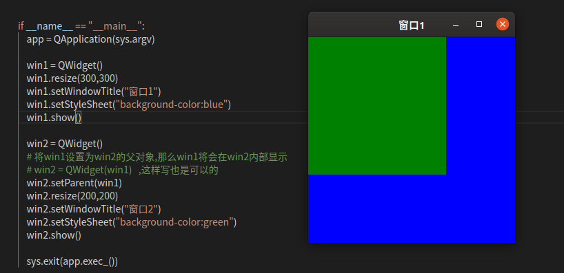
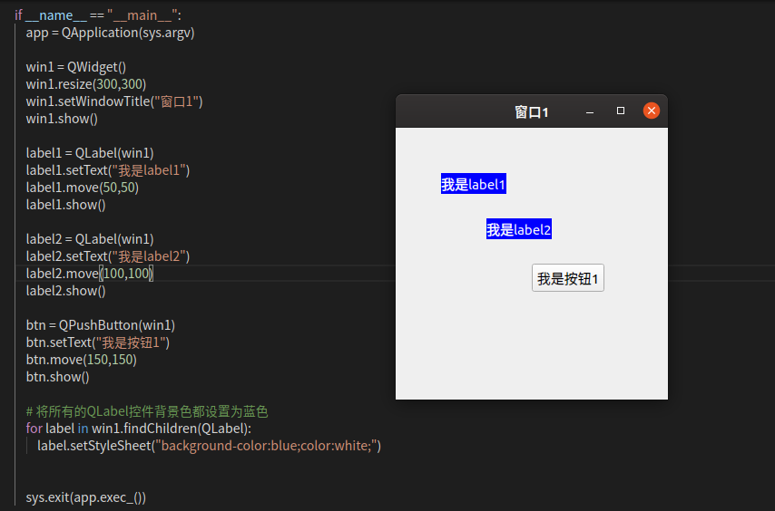
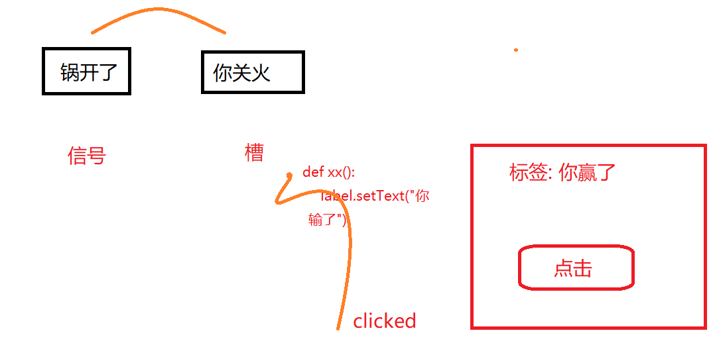
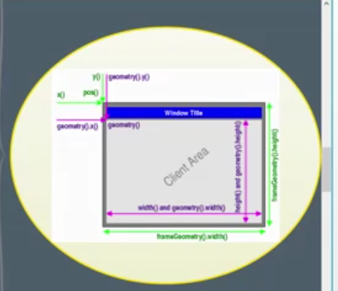

# PyQt5学习
## 1.PyQt5代码结构
```
# !/usr/bin/python3
# -*- coding:utf-8 -*-

# 导入需要的包和模块
import sys
from PyQt5.QtWidgets import QApplication,QWidget,QLabel

# 1.创建一个应用程序对象
app = QApplication(sys.argv)   # sys.argv 是从命令行传递的参数，是个列表
# app.arguments()    这行代码也可以从命令行获取到参数列表

# 2.控件的操作
# 创建控件，设置控件(大小，位置，样式)，事件，信号的处理
# 当我们创建一个控件之后，如果说，这个控件没有父控件，则把它当作顶层控件(窗口)
# 系统会自动的给窗口添加一些装饰（标题栏),窗口控件具备一些特性（设置标题，图标)

#控件也可以作为容器，盛载其他的控件
window = QWidget()

# 设置控件
window.setWindowTitle('你好，中国')
# 设置大小
window.resize(500,500) 
# 设置位置     
window.move(400,200)

label = QLabel(window)
label.setText('aaaaaaaaaaaa')
label.move(200,200)

# 显示控件
# 刚创建好一个控件后（这个控件没有什么副控件）,默认情况下不会被展示，
# 只有手动的调用show()才会展示
window.show()

# 3.应用程序的执行，进入到消息循环，即无限循环
# 检测整个程序所接收到的用户的信息
sys.exit(app.exec_())

```

## 2.PyQt5代码结构面向对象版本
```
# !/usr/bin/python3
# -*-  coding:utf-8  -*-

import sys
from PyQt5.QtWidgets import QApplication, QWidget, QLabel


class Window(QWidget):
    def __init__(self):
        super().__init__()
        self.resize(500, 500)
        self.move(200, 200)
        self.setWindowTitle("PyQt5学习")
        self.show()

    def init_ui(self):
        pass


if __name__ == "__main__":
    app = QApplication(sys.argv)
    window = Window()
    sys.exit(app.exec_())

```

## 3.控件的学习
### 各个控件的演示效果
[Python-GUI编程(12.04).xmind](_v_attachments/20200126233058888_14690/Python-GUI编程(12.04).xmind)





### 如何查看类与子类间的关系
比如查看QWidget类的子类有哪些？
```
print( QWidget.__subclasses__())
```
### 如何查看一个类的父类有哪些？
比如查看QObject


## 4.控件基类--QObject
***QObject是所有Qt对象的基类***

### 1.属性的API介绍
#### 1）setObjectName(str) 
设置对象名称
#### 2）setProperty(str, Any) → bool
设置属性
#### 3） property(str)
根据属性名称获取对应的值
#### 4)  dynamicPropertyNames() → List[QByteArray]
获取动态设置的属性名称列表
### 2.属性的API的使用场景
#### 1)对控件进行样式设置时
可以通过 .qss文件对控件的样式进行设置。
要对选取的控件进行样式设置，需要先绑定控件。有两种方式:
(1)通过控件的类名进行绑定，如QObject
(2)通过控件的名称进行绑定
需要先对控件设置名称,使用 控件.setProperty(str, Any) ,比如
```
qcheckbox.setProperty('level1','one')
qcheckbox.setProperty('level2','two')
```
在qss文件中使用如下,
```
QCheckBox[level1=one]{
    color:red;
}
QCheckBox[level2=two]{
    color:blue;
}
```

.qss文件的语法与css文件的语法类似，只是没有后者强大
通过控件进行样式绑定,如
```
QCheckBox, QComboBox, QSpinBox {
color: red;
background-color: white;
font: bold;
}
```
为控件设置名称后，可以通过名称进行绑定
```
QCheckBox.setObjectName('mycheckbox')
```
在qss文件中使用
```
QCheckBox#mycheckbox{
    color:red
}
```

### 3.对象的父子关系
#### 1.父子对象的操作
##### 1.控件对象1.setParent(控件对象2)
将控件对象2设置为控件对象1的父对象
如果给控件对象设置了多个父对象，那么以最后一个为准，即只会有一个
##### 2.控件对象1.parent()
获取控件对象1的父对象 
###### 3.控件对象.children()
获取控件对象的直接子对象，可能有多个
###### 4.findChild(const QString &aName = QString(), Qt::FindChildOptions options = Qt::FindChildrenRecursively) const
获取某一个指定名称和类型的子对象
参数1:类型名称 
参数2:对象名称，通过setObjectName()进行设置
参数3:查找选项，递归查找(默认)和查找直接子对象
###### 5.findChildren(const QString &aName = QString(), Qt::FindChildOptions options = Qt::FindChildrenRecursively) const
和findChild方法类似，只是返回的是多个

#### 2.Qt内存管理机制
 1）如果绑定了父子关系，当父对象被销毁时，子对象也会被销毁。
#### 3.对Qt控件的影响
1）如果一个控件没有任何父控件，那么系统会将这个控件当成顶层控件(窗口)
1）如果想要将一个控件包含在另一个控件的内部，那么必须要设置父子关系
（1）子控件的显示位置受到父控件的约束
（2）子控件的生命周期受到父控件的接管

案例1：
将一个控件放在另一个控件的内部，使用setParent()方法


案例2：
在QWidget控件中放入多个子控件，包含QPushButton,QLabel,其中，所有的QLabel的背景色都设置为蓝色


#### 4.信号的操作
##### 1）信号与槽的概念


信号(sign)和槽(slot)是Qt中的核心机制，主要作用在对象之间进行通讯
信号：当一个控件状态发生改变时，向外界发出的信息
槽:一个执行某些操作/函数的方法
所有继承自QWidget的控件都支持“信号与槽”的机制

#### 5.信号与槽的基本使用
##### 1）内置的信号
像按钮QPushButton.pressed事件，QPushButton.clicked事件等等
##### 2）槽
可以是控件内置的槽函数，也可以是自定义槽函数
##### 3）信号与槽的API操作
使用QObject对象来举例：
###### QObject内置的信号有两个:
1)objectNameChanged(ObjectName):对象名称发生改变时发射此信号
   控件对象.objectNameChanged.connect(槽函数)
    这里的槽名称，即函数，要执行的操作
2）destroyed(obj):对象被销毁时，发射此信号
  
######  取消信号与槽的连接
1)控件名称.信号.disconnect()    取消信号与槽的连接
2）控件对象.blockSignals(True)      临时阻断信号与槽的连接
3）控件对象.blockSignals(False)     恢复信号与槽的连接
4) 控件对象.signalsBlocked()         判断当前信号是否被阻断, True或False
5)控件对象.receivers(信号)             
        检测当前控件的某个信号连接了几个槽，这里的信号不是字符串

###### 案例
1）点击按钮，打印点我干啥
    使用到  按钮对象.clicked.connect(槽函数)
2）设置窗口标题，自动加上前缀   "陈大科-"
    使用到  窗口对象.windowTitleChanged.connect(槽函数)
               窗口对象.signalsBlock(True)
               窗口对象.signalsBlock(False)

###### 类型判定
1）对象.isWindgetType()    判断是否是控件类型
2）控件对象.inherits(控件类名称字符串)    判断控件是否是继承某个类，直接或者间接都是True


###### 对象删除
1）控件对象.deleteLater()                  稍后再删除对象
这个方法在删除对象的时候，会解除与父对象的关系，先执行完整个消息机制，在下一次循环中再删除
想要删除某个控件对象的时候，就用这个方法。
del 控件对象并不能解除与其他对象的引用关系###### 事件机制
1）代码演练
  （1）当用户操作软件时，会在软件上产生各种事件消息，这些事件消息会被系统接收到
  （2）系统会把接收到的消息分发到对应的应用消息队列中
  （3）每个应用系统都有一个事件消息循环机制，在不停的监听各种消息。
         如果有新的消息被接收到，就会被包装成一个QEvent事件对象，然后被QApplication对象的notify()方法所接收。
  （4）notify()方法会将该消息分发到对应的控件类的event()方法中
  （5）在event()方法中会根据对应的事件类型，分发给对应的函数

```

# ! /usr/bin/python3 
# -*- coding: utf-8  -*-

'''
事件机制：所有的事件都先被传送到QApplication对象的notify()方法中
                      然后再由notify方法分发到对应的控件类中，再由对应控件类的
                      event()方法来执行相应的事件

                      如果要对事件机制进行自定义，需要重写 QApplication类的notify()方法
'''
import sys
from PyQt5.QtWidgets import QApplication,QWidget,QPushButton
from PyQt5.QtCore import QEvent

class MyApp(QApplication):
    def __init__(self,*argv,**kws):
        super().__init__(*argv,**kws)

    def notify(self, receiver, evnt):
        """
        这个函数接收事件发生的对象以及对应的事件
        可以在这个方法中过滤掉某些事件

        如果想要自定义事件的具体执行，那就必须在对应控件类里重写Event()方法了
        """
        # 如果这个控件对象是继承自QPushButton并且事件类型是鼠标点击事件
        if receiver.inherits('QPushButton') and evnt.type() == QEvent.MouseButtonPress:
            print('鼠标点击事件被触发了...')

        return super().notify(receiver,evnt)


class MyPushButton(QPushButton):
    """
    该类继承QPushButton类，重写Event()方法
    """
    def __init__(self,*argv,**kwds):
        super().__init__(*argv,**kwds)

    def event(self, evnt):
        """
        重写event()方法,    这里的evnt是QEvent类
        """
        if evnt.type() == QEvent.MouseButtonPress:
            print('是点击事件')
        return super().event(evnt)

    def mousePressEvent(self, QMouseEvent):
        """
        这里重写了对应的事件
        """
        print("是鼠标点击事件")
        super().mousePressEvent(QMouseEvent)

app = MyApp(sys.argv)
win = QWidget()
win.show()

btn = MyPushButton(win)
btn.setText('QPushButton按钮')
def mycao1():
    print('按钮被点击了....')

btn.clicked.connect(mycao1)
btn.show()

sys.exit(app.exec_())

```

###### 定时器
在类的内部重写 timerEvent()方法，来实现定时器的使用。
使用类的继承来重写

1）定时器id = 控件对象.startTimer(间隔时间(毫秒）)                                开启一个定时器
2)  控件对象.killTimer( 定时器id )                                                             杀死一个定时器
3)   timerEvent() 方法                                                                             定时器会调用该类的此方法，重写此方法来实现功能

######  定时器案例
1）label控件的倒计时功能， 从10倒数到0后停止
2）每隔0.5秒中窗口的宽高都增加1px
```
# !/usr/bin/python3
# -*— coding: utf-8 -*-

import sys
from PyQt5.QtWidgets import QApplication,QWidget,QLabel

class MyWidget(QWidget):
    def __init__(self,*args,**kwargs):
        super().__init__(*args,**kwargs)
        self.timer = self.startTimer(500)

    def timerEvent(self, evnt):
        print("监听到了....")
        win_w = self.width()
        win_h = self.height()
        win_w += 3
        win_h += 3
        self.resize(win_w, win_h)

class MyLabel(QLabel):
    def __init__(self,*argv,**kwargs):
        super().__init__(*argv,**kwargs)
        self.timer = None
    """
    每个控件类中都存在一个 timerEvent()方法，重写该方法达到使用定时器的目的
    """
    def timerEvent(self, QTimerEvent):
        # 开启一个定时器，时间间隔为1秒
        num = int(self.text())
        num -= 1
        self.setText(str(num))
        if num <= 0:
            print("停止了")
            self.killTimer(self.timer1)

    def setTimeout(self,msecond):
        """
        自定义开启时间间隔
        """
        self.timer = self.startTimer(msecond)

app = QApplication(sys.argv)
win = MyWidget()
win.resize(100,100)
win.show()

label = MyLabel()
label.setParent(win)
label.setText("10")
label.move(100,100)
label.setTimeout(2000)
label.show()

sys.exit(app.exec_())
```
## 5.QWidget控件
1）所有的可视控件的基类
2）是一个最简单的空白控件
3）控件是用户界面的最小元素
        （1）接收各种事件
        （2）绘制在桌面上，展示给用户看
 4）每个控件都是矩形的，它们按照Z轴顺序进行排列
 5）控件由其父控件和前面的控件裁剪
 6）没有父控件的控件被称为窗口

(7)查看QWidget继承自哪些类
      1）在编辑器中查看类定义的方式
      2）可以使用  QWidget.__bases__属性,    返回的是一个元组 
      (<class 'PyQt5.QtCore.QObject'>, <class 'PyQt5.QtGui.QPaintDevice'>)
      3） 可以使用 QWidget.mro()        返回的是一个继承链，一级一级的继承关系

### 1.QWidget控件的创建
### 2.控件的坐标系统
  以左上角为坐标原点，向右为X轴正方向，向下为y轴正方向。
  如果一个控件有父控件，那么则是以父控件的左上角为原点的。

###  3.尺寸获取
1）x()      相对于父控件的x位置，包含窗口框架
               顶层控件（没有父控件），则相对于桌面的x位置
2） y()      相对于父控件的y位置
                顶层控件（没有父控件），则相对于桌面的y位置
3） pos()   x和y的组合
                QPiont(x,y)
4) width()   控件的宽度，不包含任何窗口框架
    height()  控件的高度，不包含任何窗口框架
    size()      宽和高的组合
                  QSize(width,height)
5)geometry()      用户区域相对于父控件的位置和尺寸组合
                          QRect(x,y,width,height)
6)rect()           0,0,width,height的组合
                      QRect(0,0,width,height)
7)frameSize()      框架大小
8）frameGeometry()  框架尺寸


   注意:控件信息完毕之后，具体的位置或者尺寸数据才会正确

### 4.尺寸设置
1）move(x,y)    操控的是x,y，也就是pos(x,y)
2)  resize(w,h)    操作的是w,h,不包括窗口框架
3）setGeometry(x_noFrame,y_noFrame,width,height)                         此处参考为用户区域
4) adjustSize()                                                                                     自适应大小
5)setFixedSize()                                  设置固定尺寸，窗口右上角无法最大化，鼠标无法调整窗体大小