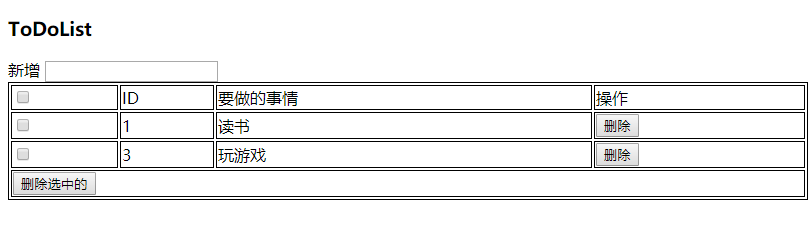

##### 1基础语法
###### 1.插值表达式：{{ 内容 }}     用两对花括号包起来的语法，叫做插值或插值表达式。
    1）插值表达式支持表达式运算

###### 2.指令操作
        1) v-if:
              v-if 指令将根据表达式的值的真假来操作dom元素。
        2) v-text:   绑定文本，和插值表达式功能一样，但是会覆盖原内容
        3）v-html:绑定html代码，可以解析html代码
        4） v-bind: 绑定属性
                           例如:  <p></p>
        5)  v-model:双向绑定

单向数据绑定:  Vue实例中的数据改变，会影响到DOM中的数据。
                        但是DOM中的数据改变，不会影响到Vue实例中的数据。

双向数据绑定:  Vue实例中的数据改变，同时会影响到DOM中的数据。
                      而且DOM中的数据改变，也会影响到Vue实例中的数据。
                 v-mode是一个双向绑定指令，
                 限制 ：  input,  select,   textarea 起作用

        6） v-show:隐藏或显示
                  是控制css样式中的display属性。

        7） v-if  v-else-if v-else
               8)v-for
                遍历数据
                8) v-cloak:如果页面出现了延时加载，可以把插值表达式隐藏起来，直到加载成功后再显示。
                            <p v-cloak>{{msg}}</p>
                            还需要配合css样式使用，必须通过数组的方式
                            [v-cloak]{
                                display:none;
                            }
                9)v-once:只执行一次

练手案例：
        TodoList
        可以参考todomvc     网址 ：http://todomvc.com/

    1.template标签可以替换掉div标签。

js array数组的filter()方法，可以替代for循环。

MVVM设计思想

小案例:
common.js
```lang
var tools = {
    //针对json数组进行查找，返回下表位置
    findIndex(arr,val){
        var index = -1;
        arr.forEach((v,k)=>{
            if( v.id == val ){
                index = k;
            }
        });
        return index;
    }
};
```
test2.html
```lang
<!DOCTYPE html>
<html lang="zh">
<head>
    <meta charset="UTF-8">
    <title>Title</title>
    <script src="js/vue.2.6.11.js"></script>
    <style>
        table{width:800px;border:1px solid #000;}
        tr{width:100%;border:1px solid #000;}
        td{border:1px solid black;}

    </style>
</head>
<body>
    <div id="app">
        <h3>{{title}}</h3>
        <div>
            <label>新增</label>
            <input type=text @keyup.enter="add"/>
        </div>
        <table>
            <thead>
                <tr>
                    <td><input type="checkbox" @change="selectAll" /></td>
                    <td>ID</td>
                    <td>要做的事情</td>
                    <td>操作</td>
                </tr>
            </thead>
            <tbody>
                <tr v-for="(v,k) in lists">
                    <td><input type="checkbox" v-model="v.status"/></td>
                    <td>{{v.id}}</td>
                    <td>{{v.title}}</td>
                    <td><button @click='del(v.id)'>删除</button></td>
                </tr>
            </tbody>
            <tfoot>
                <tr>
                    <td colspan="4"><button @click="delSelected">删除选中的</button></td>
                </tr>
            </tfoot>
        </table>


    </div>

    <script src="js/common.js"></script>
    <script src="js/app.js"></script>
    
</body>
</html>
```
app.js
```lang
;(function(Vue){

    var lists = [
        {id:1,title:'读书',status:true},
        {id:2,title:'写字',status:true},
        {id:3,title:'玩游戏',status:false},
    ];

    app = new Vue({
        el:'#app',
        data:{
           title:'ToDoList',
           lists:lists
        },
        methods:{
            //新增
            add(event){
                var title = event.target.value;
                if( title ){
                    var id = lists[lists.length-1].id * 5;
                    var status = false;
                    this.lists.push({id,title,status});
                    event.target.value = '';
                }
                
            },
            //全选/全不选
            selectAll(event){
                
                this.lists.forEach((v,k)=>{this.lists[k].status = event.target.checked})
            },
            //单个删除
            del( id ){
                var index = tools.findIndex(this.lists,id);
                this.lists.splice(index,1);
            },
            //删除选中的
            delSelected(){
                this.lists = this.lists.filter(v=>!v.status);
            }
        }
    });

})(Vue);
```



###### 3.MVVM思想
###### 4.计算属性computed
*当在插值表达式中进行了过多的逻辑运算时，就需要考虑使用计算属性了。*
我们可以将同一函数定义为一个方法而不是一个计算属性。两种方式的最终结果确实是完全相同的。然而，不同的是计算属性是基于它们的响应式依赖进行缓存的。只在相关响应式依赖发生改变时它们才会重新求值。这就意味着只要 message 还没有发生改变，多次访问 reversedMessage 计算属性会立即返回之前的计算结果，而不必再次执行函数。

###### 5.侦听器 watch

###### 6.使用$refs操作DOM
```
<p ref='pv'>12345</p>

在方法中：
this.$refs.pv  即可找到该节点
```

###### 7.过滤器 filters
1.  私有过滤器(局部过滤器)
只在自己的Vue实例中定义的过滤器，只在自己的作用域内有效。
2.  全局过滤器
```
Vue.filter('capitalize', function (value) {
  if (!value) return ''
  value = value.toString()
  return value.charAt(0).toUpperCase() + value.slice(1)
})
```

###### 8.自定义指令 directive
1. 全局自定义指令
2.  私有指令

###### 9.动画及过过渡效果

###### 10.JSON-Server
 前端工程师在后台没有搭建的情况下，可以使用JSON-Server来模拟接口获取数据。
 https://www.npmjs.com/package/json-server

###### 11.ToDoList的完善

##### 2.组件
######  1.组件的基本使用