2019年最全最新Vue、Vuejs教程，从入门到精通
视频地址   https://www.bilibili.com/video/BV15741177Eh?p=2
# 1_认识VueJS
## 1.介绍
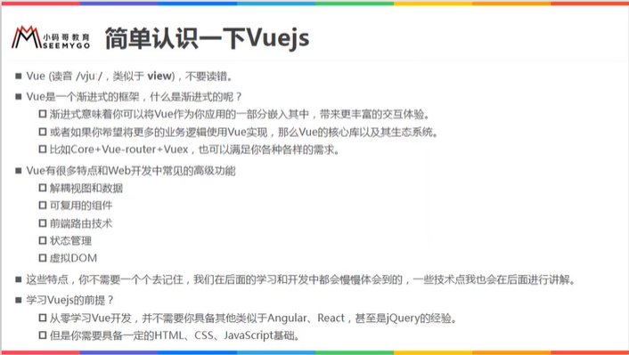
## 2.什么是渐进式？
- 个人理解：可以只使用一部分，不必要全部都使用我的！
# 2.安装VueJS
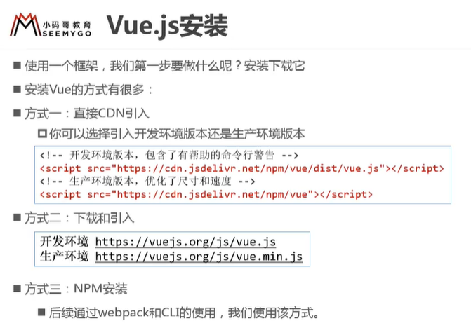
## 安装方式
### 1.CDN直接引入
### 2.下载引入
### 3.npm安装

# 3.初体验
## 案例1.hello,vuejs
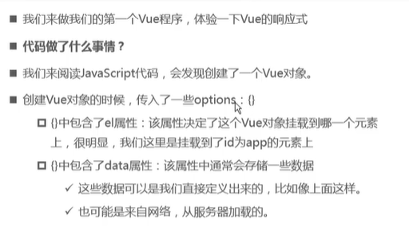
## 案例2.Vue列表展示

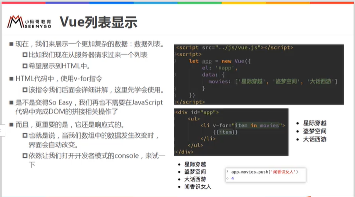

## 案例3:计数器
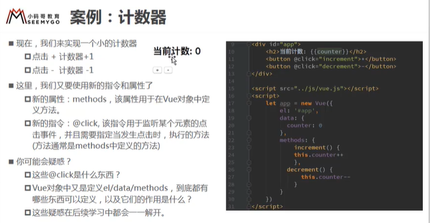

# 4.Vue的MVVM介绍
MVVM:   M-model    V-View  VM-ViewModel
MVVM是一种软件架构模式
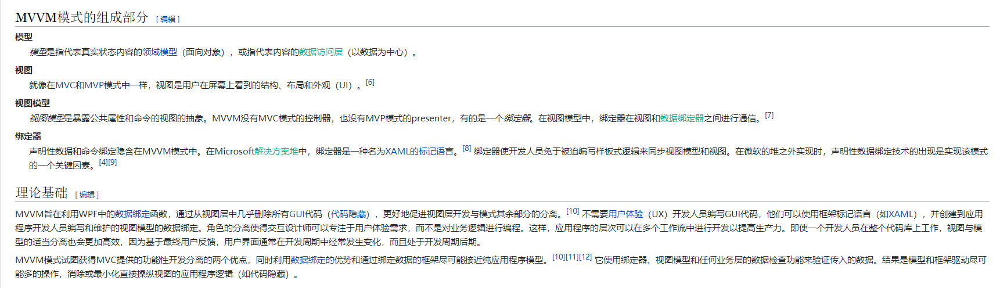
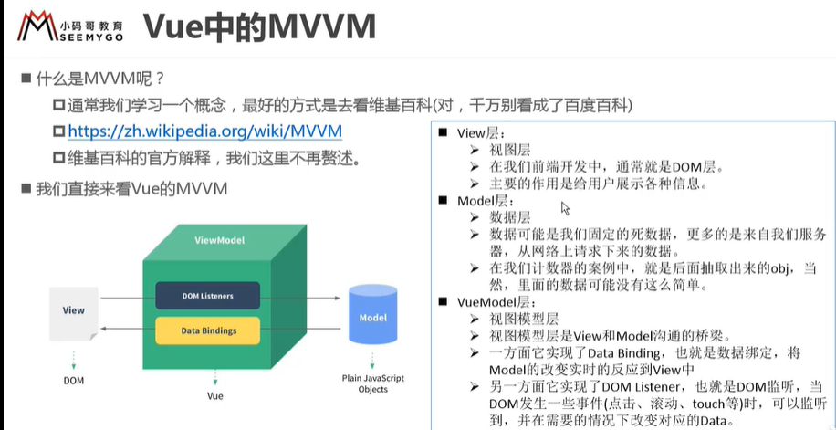

# 5.Vue的options选项
# 6.Vue的生命周期
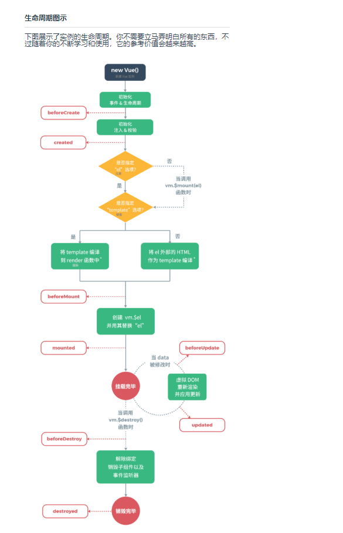
生命周期:事物从诞生到消亡的一个过程！
# 7.Vue的部分生命周期函数(钩子函数)
- beforeCreate:
- created:  这里面可以做请求数据的操作
- mounted：这里可以将dom进行挂载
# 8.插值表达式 mustache
```
1.普通字符串
{{lastname}}
2.执行运算操作
{{a1 - a2}}
{{firstname + lastname}}
{{counter * 100}}
{{num / 100}}
```
# 4.其他指令使用
## 1.v-once
 vue-once:只会渲染一次，如果说不希望数据改变后还会进行渲染的，可以使用这个指令！
## 2.v-html
可以渲染html内容，可以保持html的样式不变
## 3.v-text
展示字符串，和插值表达式作用相同
## 4.v-pre
将内容原封不动的展示出来
## 5.v-cloak
这个指令保持在元素上直到关联实例结束编译。和 CSS 规则如 [v-cloak] { display: none } 一起用时，
这个指令可以隐藏未编译的 Mustache 标签直到实例准备完毕。

# 5.v-bind基本使用
## 1.v-bind绑定一些属性
动态绑定属性
- 缩写: `:`
- 预期: any (with argument) | Object (without argument)
- 参数：attrOrProp (optional)
- 修饰符: 
```
.prop - 作为一个 DOM property 绑定而不是作为 attribute 绑定。(差别在哪里？)
.camel - (2.1.0+) 将 kebab-case attribute 名转换为 camelCase。(从 2.1.0 开始支持)
.sync (2.3.0+) 语法糖，会扩展成一个更新父组件绑定值的 v-on 侦听器。
```
- 用法
动态地绑定一个或多个 attribute，或一个组件 prop 到表达式。
在绑定 class 或 style attribute 时，支持其它类型的值，如数组或对象。可以通过下面的教程链接查看详情。
在绑定 prop 时，prop 必须在子组件中声明。可以用修饰符指定不同的绑定类型。
没有参数时，可以绑定到一个包含键值对的对象。注意此时 class 和 style 绑定不支持数组和对象。

## 2.v-bind绑定class属性(对象语法)
1.普通的绑定形式
```
<div v-bind:class="active"></div>
```
2.可以绑定一个对象
```
<div v-bind:class="{active:true,line:false}"></div>
```
只有值为true的才会被绑定上去

## 3.v-bind绑定class属性(数组语法)
```
<div v-bind:class="[active,line]"></div>
```
其中,active加上引号，表示是一个普通的字符串，不加引号，将会被解析成一个变量！

## 4.动态绑定style属性(对象语法)
```
<div :style="{属性名称1:属性值1,属性名称2:属性值2,...}"></div>
```
注意：这里的属性值必须要加上引号，是字符串，否则vue会当成变量进行解析报错的

## 5.动态绑定style属性(数组语法)
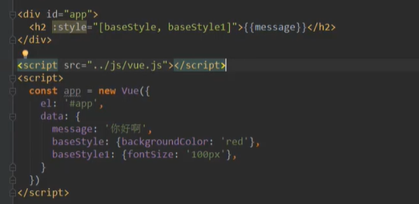

# 6.计算属性
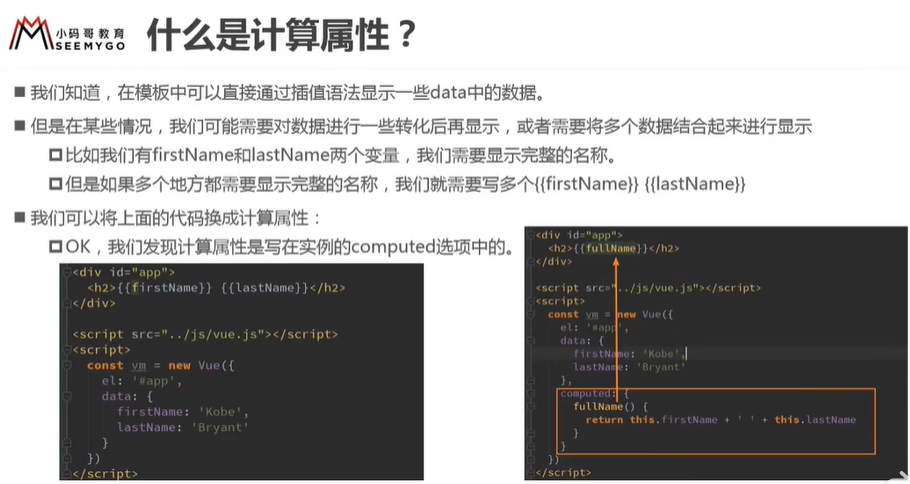

个人理解：计算属性相当于在是对属性的二次封装，在模板中通过函数调用的方式显示出来
注意：计算属性是有缓存的，如果在属性值不变的情况下，可以考虑使用计算缓存，如果属性值是变化的，可以考虑方法

# 7.事件监听 v-on
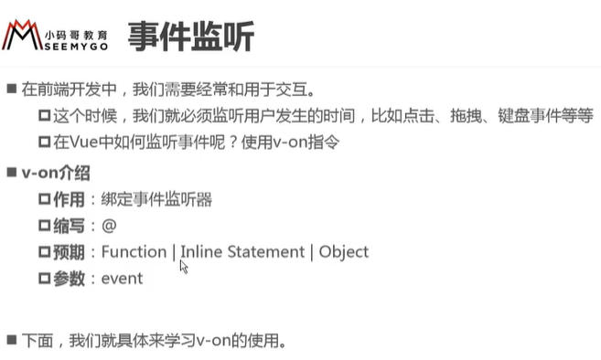
v-on的语法糖：   @事件名称
### 2.v-on的参数传递
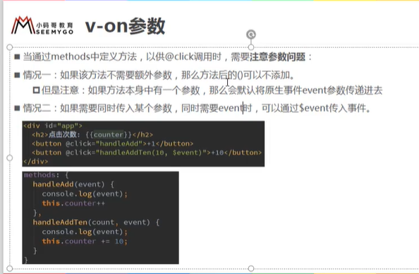
1.如果事件监听不需要传递参数，那么后面的括号可以省略
2.如果省略了后面括号，但是方法中要求传入参数，这时侯获取到的是event对象
3.第3种情况,同时需要参数和event对象
@click=fun(参数列表, $event)

### 3.v-on的修饰符
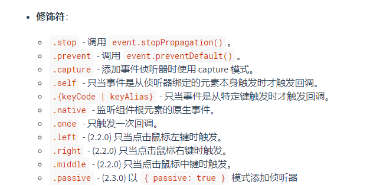
1.阻止冒泡事件：使用.stop     
2.阻止默认事件：使用.prevent，   例如表单提交的自定义提交
3.特定事件触发的回调 : .{keyCode|keyAlias},   例如监听键帽     @keyup.enter="keyUp"
4.只触发一次：  .once修饰符
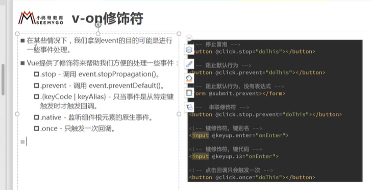

# 8.v-if和v-else的使用

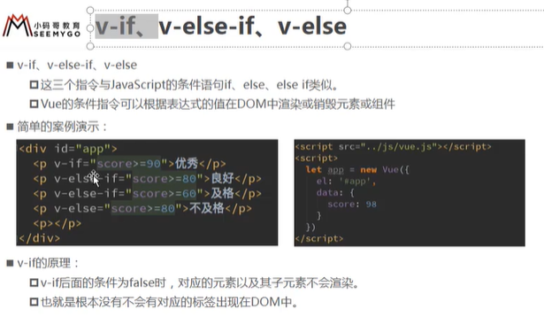
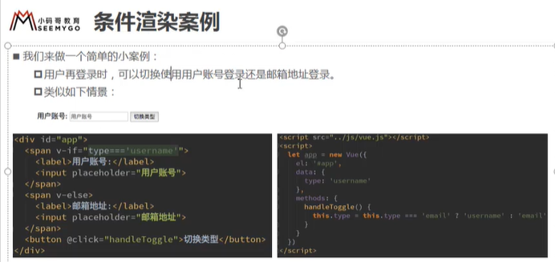

条件渲染案例，用户登陆展示
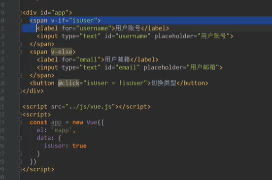
这里有个小问题？就是当切换登陆方式后，之前输入的内容还会在另一个输入框中显示出来，有时候并不希望这样！
案例解答：
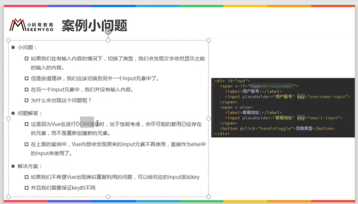
如果不希望复用，可以加个key属性，并且要保证key值的不相同

# 9.v-show
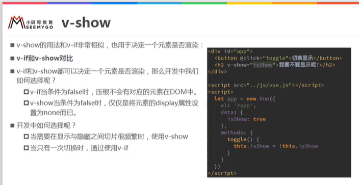
v-show和v-if的区别:
v-if是直接移除掉对应的dom节点，不占用空间
v-show是在dom节点上添加display:none属性，隐藏起来了，占用空间

#10.过滤器 filters
过滤器：  filters
使用方法    值|过滤器    通过管道命令

# 10.购物车案例
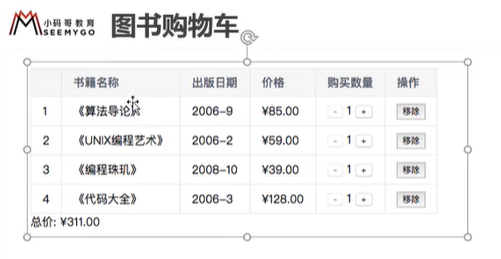
style.css
```
.table{
	border:1px solid #ddd;
	border-collapse: separate;
	border-spacing: 0px;
	text-align: center;
}
.table tr{
	margin-top: 8px;
	margin-bottom: 8px;
}
.table tr td,th{
	margin-left:10px;
	margin-right: 10px;
	padding:8px;
	border:1px solid #ddd;
}
```
js部分 app.js
```
(function(){
	
	const app = new Vue({
		
		el:'#app',
		data:{
			title:'图书购物车',
			books:[
				{id:1,name:'算法导论',publish_date:'2006-9',price:85.00,count:1},
				{id:2,name:'UNIX编程艺术',publish_date:'2006-2',price:59.00,count:1},
				{id:3,name:'编程珠玑',publish_date:'2008-9',price:39.00,count:1},
				{id:4,name:'代码大全',publish_date:'2006-3',price:128.00,count:1}
			]
		},
		
		methods:{
			//移除书本
			btnRemoveBook(bookId){
				this.books.splice(this._getObjIndexById(this.books,bookId),1);
			},
			//加
			btnIncreament(bookId){
				let index = this._getObjIndexById(this.books,bookId);
				this.books[index].count++;
			},
			//减
			btnDecreament(bookId){
				let index = this._getObjIndexById(this.books,bookId);
				this.books[index].count--;
				
			},
			
			_getObjIndexById(arr,id){
				let ind = -1;
				arr.forEach((item,index)=>{
					ind = item.id == id?index:ind;
				});
				return ind;
			}
			
		},
		
		computed:{
			totalPrice(){
				let totalPrice = 0;
				this.books.forEach((item )=>{
					totalPrice += item.price * item.count;
				});
				return totalPrice;
			}
		},
		filters:{
			showPrice(price){
				return '￥'+price.toFixed(2);
			}
		}
		
	});
	
}());

```

html部分
index.html
```
<!DOCTYPE html>
<html>
	<head>
		<meta charset="utf-8" />
		<title></title>
		<link rel="stylesheet" type="text/css" href="./css/style.css"/>
		<script src="js/vue.js" type="text/javascript" charset="utf-8"></script>
	</head>
	<body>
		<div id="app">
			<h3>{{title}}</h3>
			
			<div v-if="books.length">
				<table class="table">
					<thead>
						<th></th>
						<th>书籍名称</th>
						<th>出版日期</th>
						<th>价格</th>
						<th>购买数量</th>
						<th>操作</th>
					</thead>
					<tbody>
						<tr v-for="item in books" :key="item.id">
							<td>{{item.id}}</td>
							<td>{{item.name}}</td>
							<td>{{item.publish_date}}</td>
							<td>{{item.price|showPrice}}</td>
							<td>
								<button @click="btnDecreament(item.id)" :disabled="item.count<=1">-</button>{{item.count}}<button @click="btnIncreament(item.id)">+</button>
							</td>
							<td>
								<button @click="btnRemoveBook(item.id)">移除</button>
							</td>
						</tr>
					</tbody>
					<tfoot>
						<tr>
							<td>总价：{{totalPrice|showPrice}}</td>
						</tr>
					</tfoot>
				</table>
			</div>
			<div v-else>
				<div>购物车为空</div>
			</div>
			
		</div>
		
		<script src="./js/app.js"></script>
	</body>
</html>

```

# 11.javascript的高阶函数使用
## 1.javascript的几种遍历方式
### 1.for (let i in 数组)
```
for(let i in 数组){
    代码
}
#这里的i代表索引下标
```
### 2.for (let item of 数组)
```
for(let item of 数组){
    代码
}
#这里的item是每一条数据
```

## 2.高阶函数的使用
### 1.三个高阶函数:filter/map/reduce
高阶函数：就是函数需要的参数，也是一个函数

#### 1.filter
filter函数要求必须要返回一个bool值，如果返回的是true,就会将这个数据放入到内部创建的数组中，否则会过滤掉这个数据。
返回的是一个数组，数组中是满足条件的数据

#### 2.map
map函数对遍历的每一项都做相同的操作，然后返回！

#### 3.reduce
reduce是对每一项做逻辑操作，共两个参数
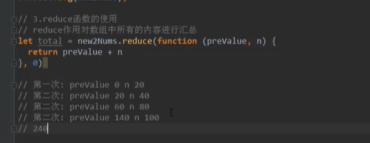

# 12.v-model的使用
## 1.基本使用
表单的双向绑定
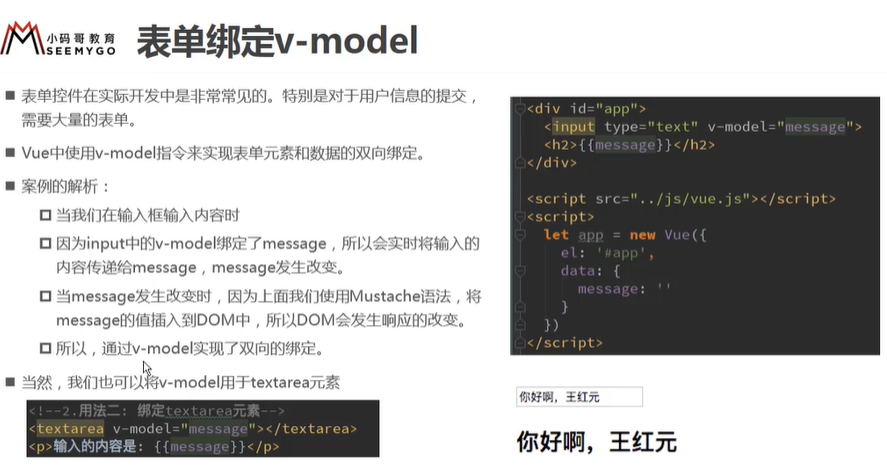
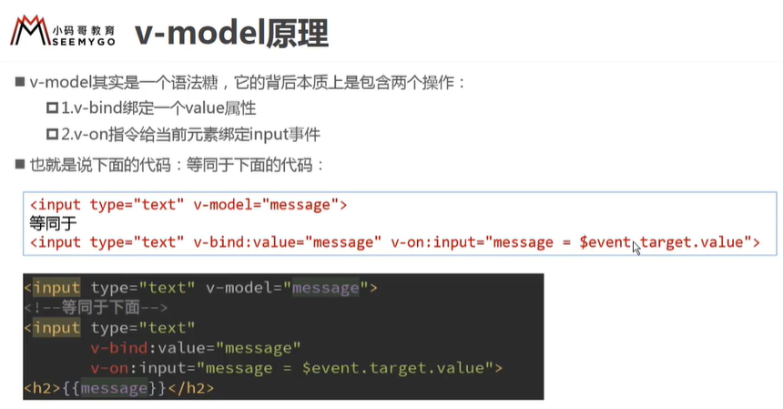
## 2.v-model与radio结合使用


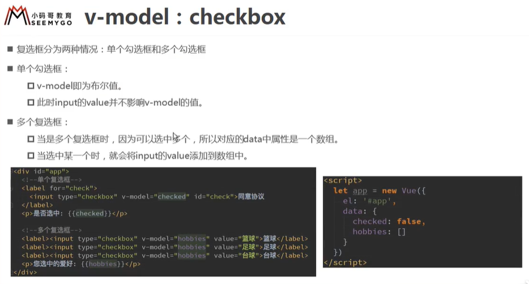

## 3.v-model与select结合使用
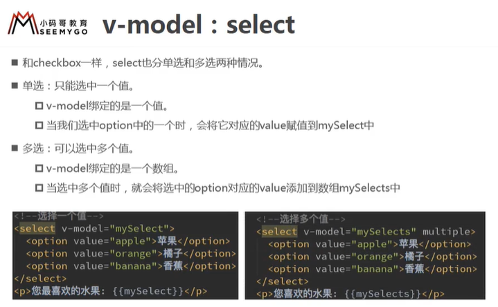
## 4.值绑定
值绑定就是：再给input标签设置值的时候，不是直接写死的，而是动态的赋值！
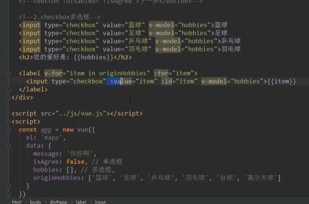

## 5.v-model修饰符
v-model的三个修饰符：
.lazy  ---   取代input监听change事件
.number  ---  输入字符串转为有效的数字
.trim  ---   输入首尾空格过滤


#  最后部分(Vue的综合)
1) el：元素节点  
2)data:   绑定数据
3)methods:   各种方法
4)computed:  计算属性，是专门对data中的数据进行操作的,里面是一个个方法，可以直接在模板中调用，不需要带括号
```
    const app = new Vue(){
        el:'#app',
        data:{},
        methods:{
            myfunction1(){
            
            }
        },
        computed:{
            属性名称:{
                set:function(){
                    
                },
                get:function(){
                
                }
            }
        
        
        }
    
    
    }


```


