# 1.什么是Vue CLI


# 2.安装vue cli的前提


# 3.Vue CLI的安装


经测试,我自己的window10电脑上需要使用 
```
vue.cmd --version
```


# 4.旧版本vue-cli2初始化项目

当前安装的是4.4版本，但是有些公司项目用的还是老的版本2版本，所以这里先要了解下旧版本的使用


ESLint:是否对js代码进行限制？
set up uint tests?   是否设置单元测试？
set up e2e tests with NightWatch?   端到端的测试？


# 5.vue-cli2的目录结构


# 6.安装CLI错误和ESLine规范

## 1.脚手架运行成功后默认的界面


# 7.理解 runtime-compiler和runtime-only的区别


*runtime-only比runtime-compiler要少6kb的代码量，性能上更好!*


上面这节适合多听几次！

https://www.bilibili.com/video/BV15741177Eh?p=95

# 8.npm run build的运行流程


# 9.给配置起别名

# 10.认识vue-cli3


创建项目


# 11.vue-cli4的目录结构


# 12.vue-cli4的配置文件查看和修改


# 13.知识点补充： ES6箭头函数与this指向


# 14.url的hash和html5的history


# 15.vue-router的安装和配置方式


# 16.路由的默认值和修改为history模式


通过重定向的方式来实现
更改为history模式


# 17.router-link的知识点补充
1.将router-link渲染成其他标签，通过tag属性
2.默认的路由使用history.pushState(),可以返回，如果不想返回，就需要改为history.replaceState(),   只需要加个replace属性就可以了
3.可以对激活状态的标签的active属性设置别名，通过 active-class


# 18.通过代码跳转路由


vue-router提供了this.$router实例
* 1.this.$router.push(路由)            //可以返回
* 2.this.$router.replace(路由)        //不可以返回
* 3.this.$router.go(n)                   //前进或者后退几步


# 19.动态路由的使用


# 20.路由懒加载的使用


# 21.认识嵌套路由


# 22.vue-router的参数传递

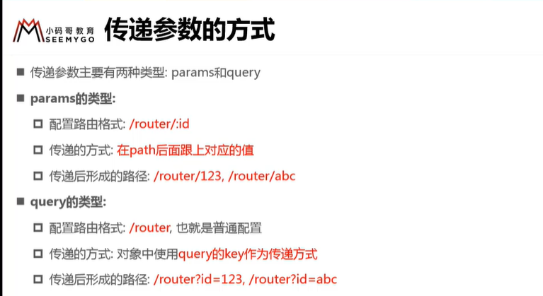
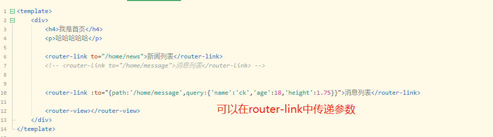
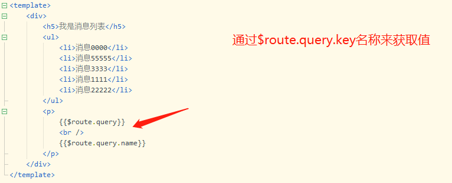
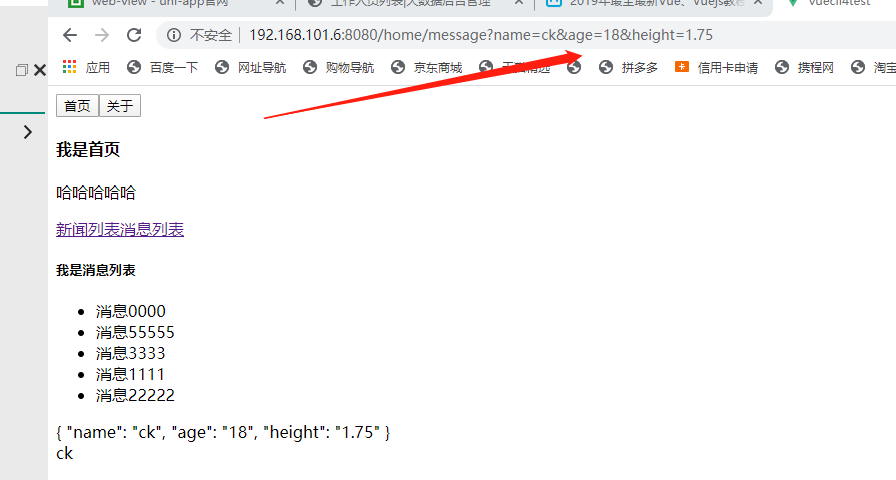

现在想要通过点击button按钮的方式进行跳转，并且传递参数
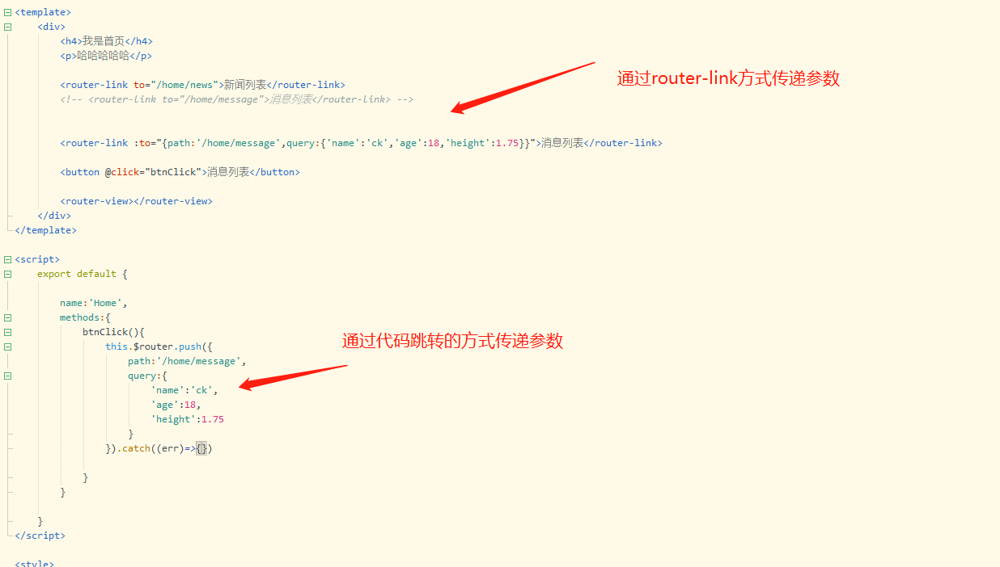

# 23.理解vue-router和route的由来(跳过了)

# 24.使用导航守卫


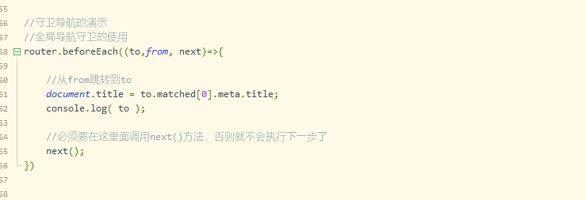

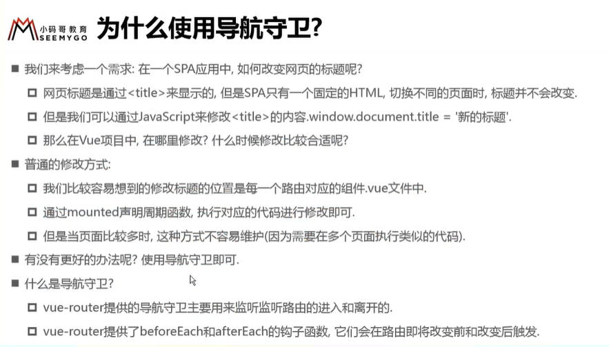

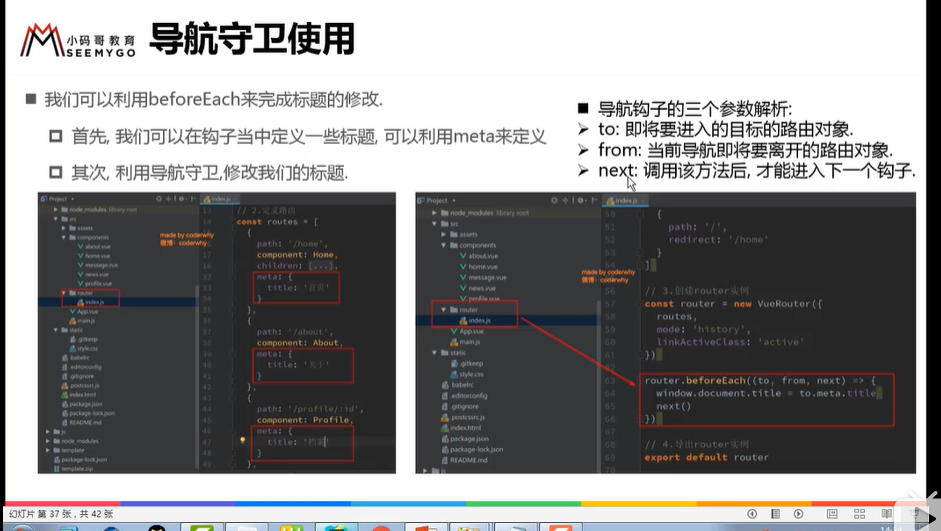


router.beforeEach()     被称为前置钩子,是在跳转之前进行的回调，也叫做钩子(hook)
router.afterEach()
都属于全局守卫

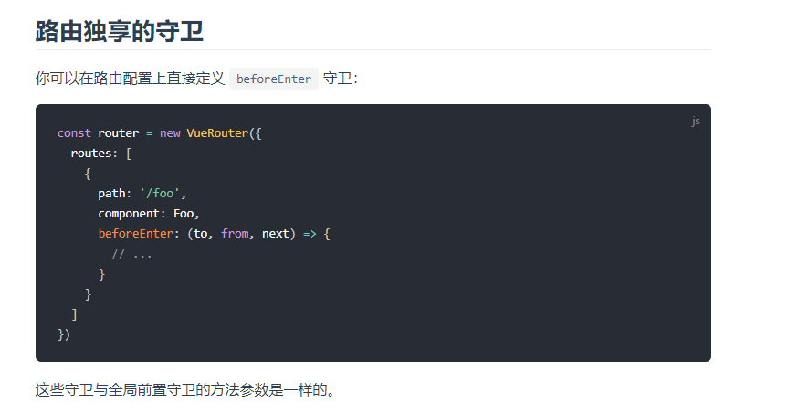
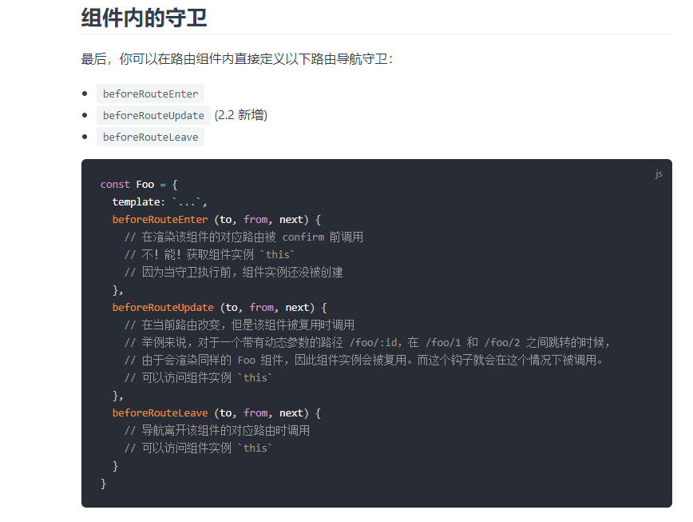


# 25.vue-router-keep-alive及其他问题
为了保存用户之前的路由状态，可以通过下面的方法

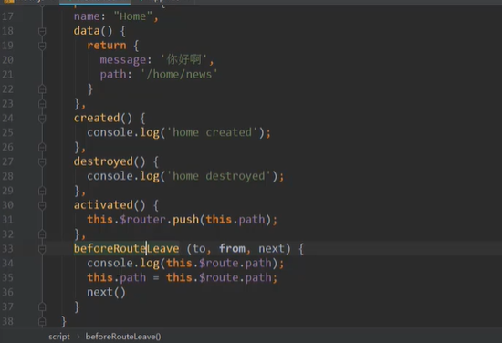

摘自博客 https://juejin.im/post/5c6e133ee51d455d06474a31
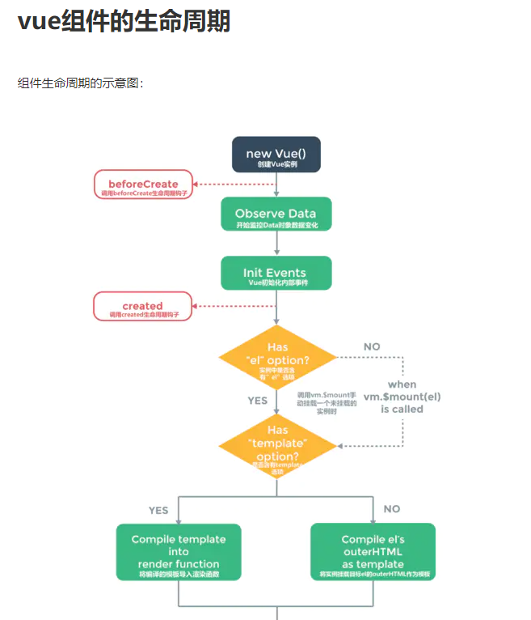
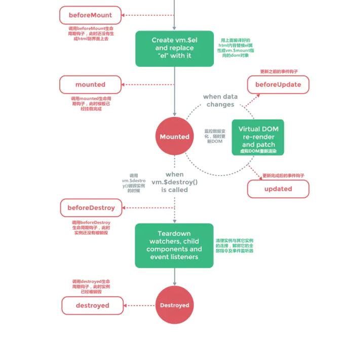
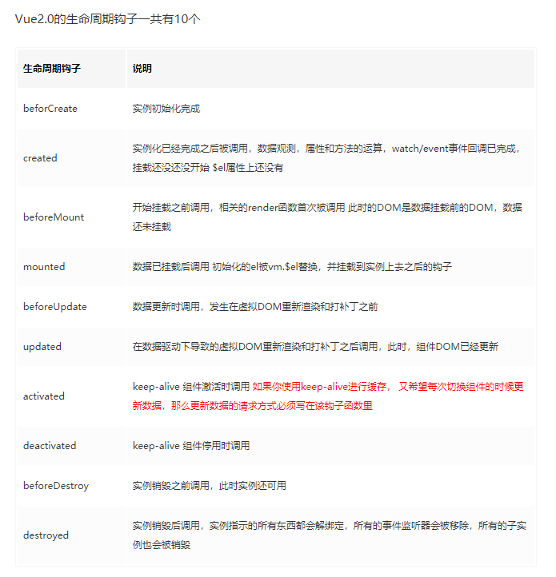
```
//生命周期：初始化阶段 运行中阶段 销毁阶段
    //html
     <div id="app">
        <app></app>
    </div>
    // js
    Vue.component("App",{
        template:`
            <div>
                <p class="myp">A组件</p>
                <button @click="destroy">destroy</button>
                <input type="text" v-model="msg">
                <p>msg:{{msg}}</p>
            </div>`,
        data:function(){
            return {msg:'hello'}
        },
        timer:null,
        methods:{
            destroy:function(){
                this.$destroy()//
            }
        },
        beforeCreate:function(){
            console.log('beforeCreate:刚刚new Vue()之后，这个时候，数据还没有挂载呢，只是一个空壳')           
            console.log(this.msg)//undefined
            console.log(document.getElementsByClassName("myp")[0])//undefined
        },
        created:function(){
            console.log('created:这个时候已经可以使用到数据，也可以更改数据,在这里更改数据不会触发updated函数')
            this.msg+='!!!'
            console.log('在这里可以在渲染前倒数第二次更改数据的机会，不会触发其他的钩子函数，一般可以在这里做初始数据的获取')
            console.log('接下来开始找实例或者组件对应的模板，编译模板为虚拟dom放入到render函数中准备渲染')
        },
        //created:() => {
            //这个写法this指向是有问题的 用箭头函数 this指向window 上面是对的
            //console.log('created:这个时候已经可以使用到数据，也可以更改数据,在这里更改数据不会触发updated函数')
            //this.msg+='!!!'
            //console.log('在这里可以在渲染前倒数第二次更改数据的机会，不会触发其他的钩子函数，一般可以在这里做初始数据的获取')
            //console.log('接下来开始找实例或者组件对应的模板，编译模板为虚拟dom放入到render函数中准备渲染')
        //},
        beforeMount:function(){
            console.log('beforeMount：虚拟dom已经创建完成，马上就要渲染,在这里也可以更改数据，不会触发updated')
            this.msg+='@@@@'
            console.log('在这里可以在渲染前最后一次更改数据的机会，不会触发其他的钩子函数，一般可以在这里做初始数据的获取')
            console.log(document.getElementsByClassName("myp")[0])//undefined
            console.log('接下来开始render，渲染出真实dom')
        },
        // render:function(createElement){
        //     console.log('render')
        //     return createElement('div','hahaha')
        // },
        mounted:function(){ 
            console.log('mounted：此时，组件已经出现在页面中，数据、真实dom都已经处理好了,事件都已经挂载好了')
            console.log(document.getElementsByClassName("myp")[0])
            console.log('可以在这里操作真实dom等事情...')

        //    this.$options.timer = setInterval(function () {
        //        console.log('setInterval')
        //         this.msg+='!'  
        //    }.bind(this),500)
        },
        beforeUpdate:function(){
            //这里不能更改数据，否则会陷入死循环
            console.log('beforeUpdate:重新渲染之前触发')
            console.log('然后vue的虚拟dom机制会重新构建虚拟dom与上一次的虚拟dom树利用diff算法进行对比之后重新渲染')         
        },
        updated:function(){
            //这里不能更改数据，否则会陷入死循环
            console.log('updated:数据已经更改完成，dom也重新render完成')
        },
        beforeDestroy:function(){
            console.log('beforeDestory:销毁前执行（$destroy方法被调用的时候就会执行）,一般在这里善后:清除计时器、清除非指令绑定的事件等等...')
            // clearInterval(this.$options.timer)
        },
        destroyed:function(){
            console.log('destroyed:组件的数据绑定、监听...都去掉了,只剩下dom空壳，这里也可以善后')
        }
    })


    
    new Vue({
        el:'#app'
    })
```

# 26.vue生命周期钩子函数actived没有执行？
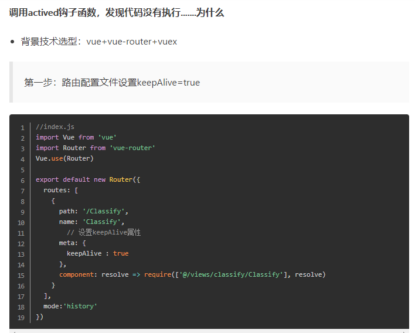
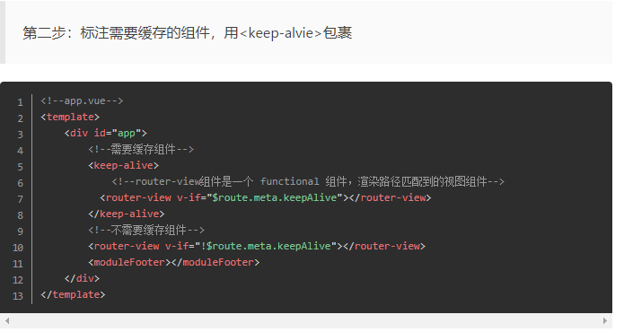
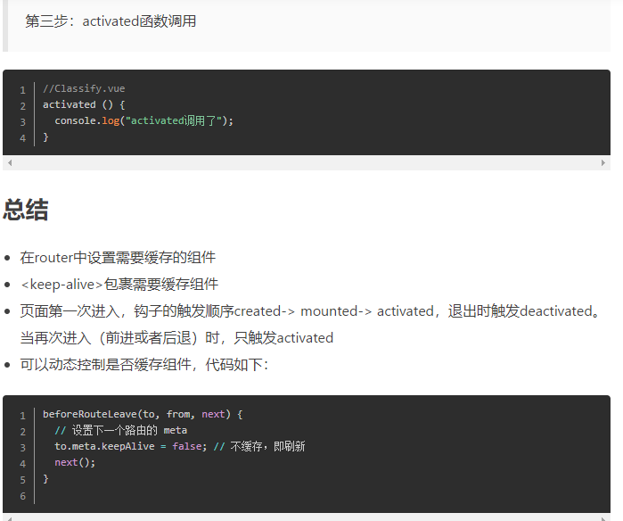
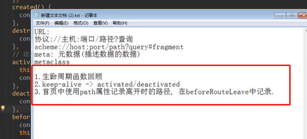

***注意点：只有使用了keep-alive,才可以使用  activated/deactivated  ,否则是不会触发的***

# 27.vue-router-keep-alive属性介绍，可以指定哪些不会被缓存
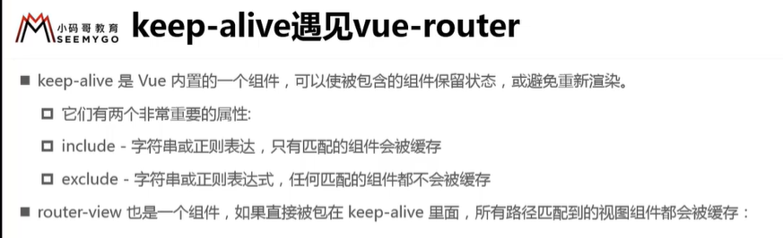
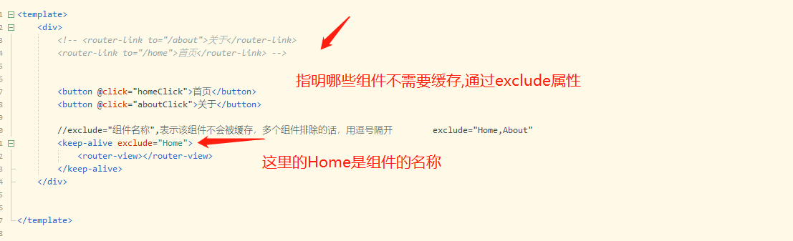

# 28.tabbar的封装(小案例)


## 1.tabbar基本结构的搭建
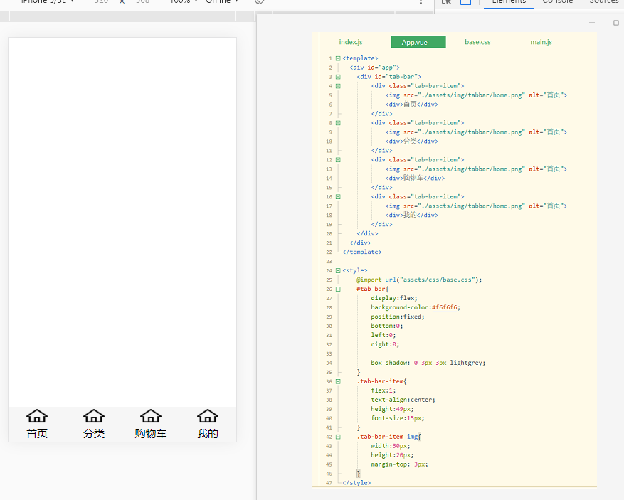
传统的思想，是将这个tabbar直接在App组件中编码渲染出来.但是Vue是组件化的思想，并不是这样搞的，这样搞不利于后期的代码维护！
下面对代码进行重新架构！
## 2.对tab-bar和tab-bar-item进行封装
用到的技术点：
1.插槽的使用

新建一个TabBar组件，将代码从App组件中抽离出去
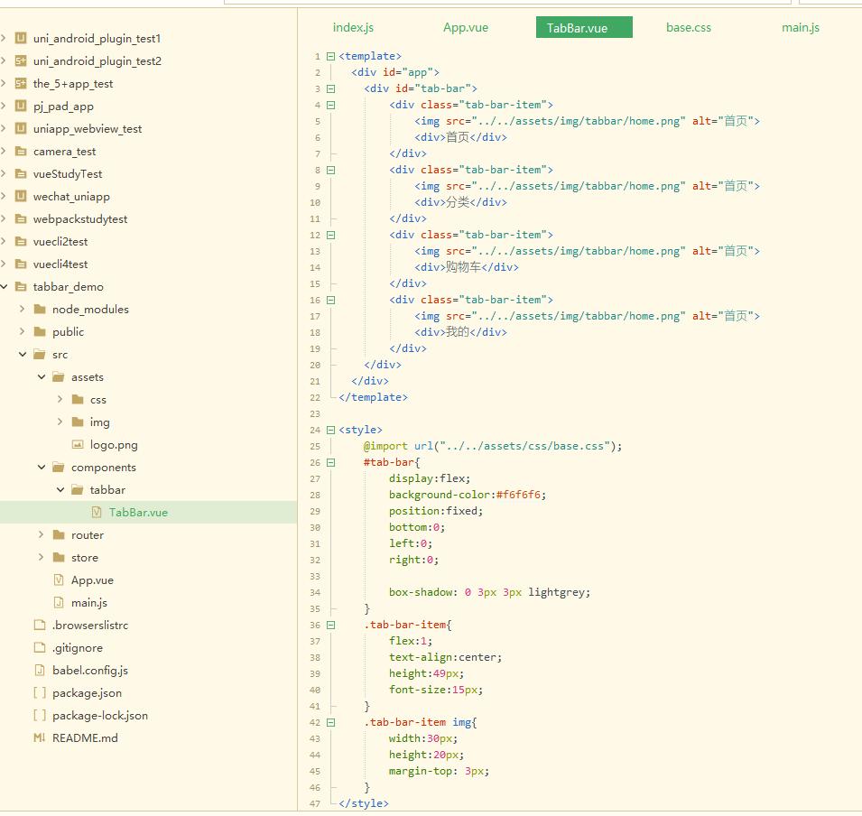

最终完成的代码演示

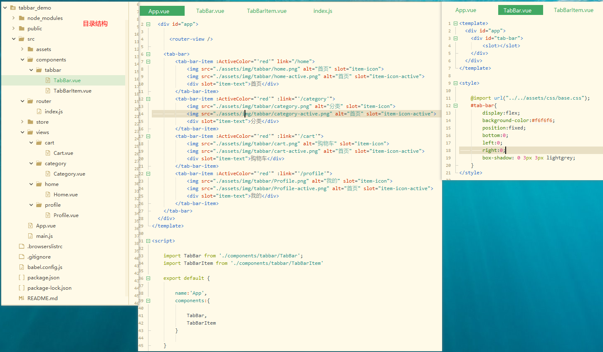
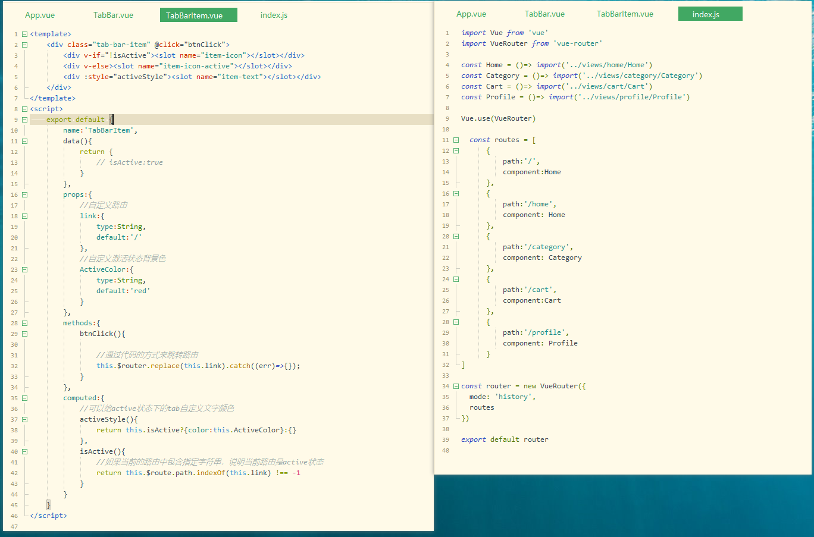

# 29.给路径设置别名
vue-cli4没有找到相关的配置方法

