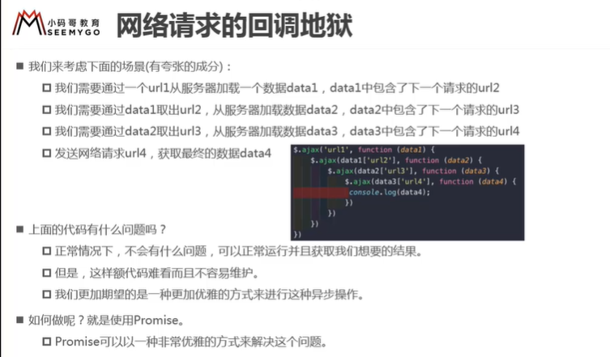
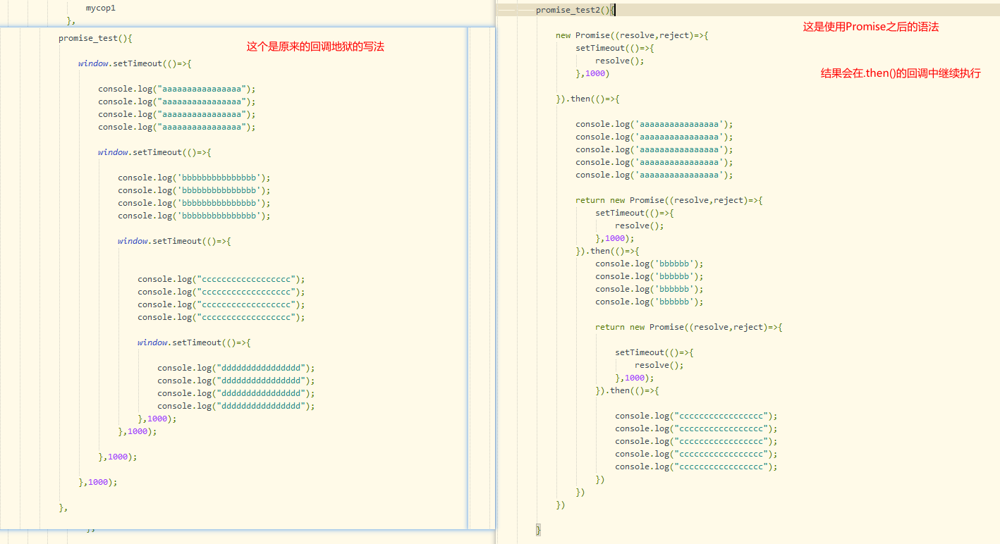
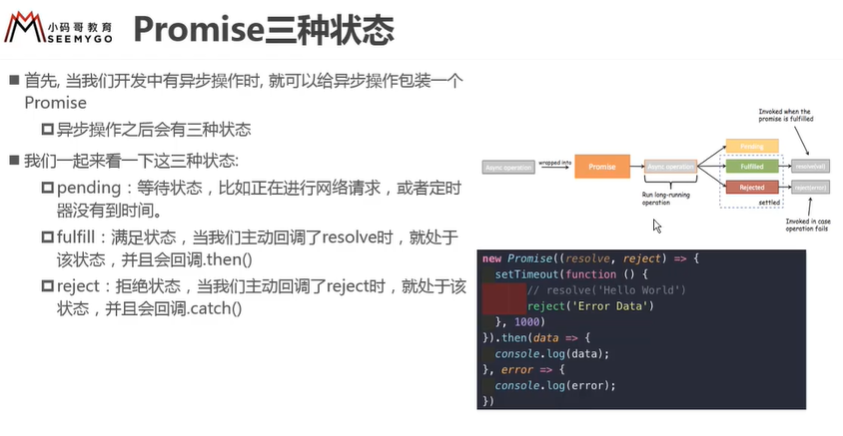
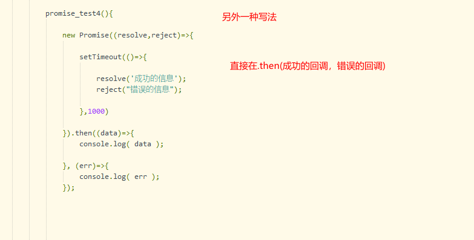
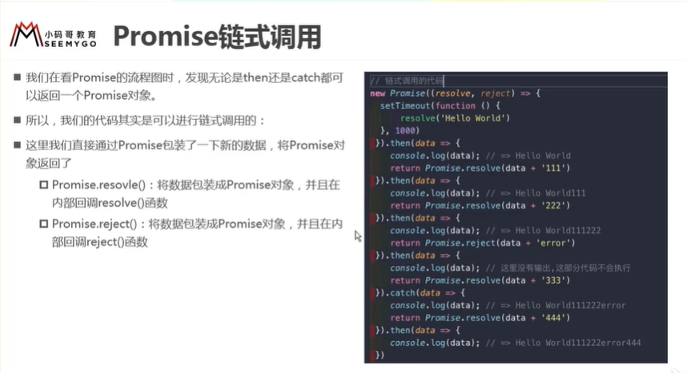
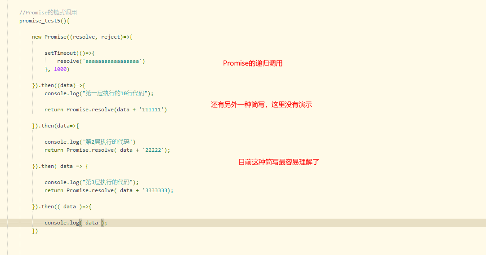
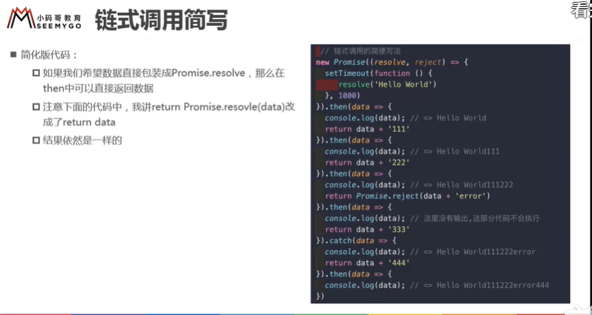
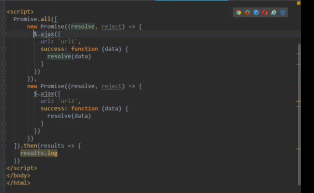

# 1.promise的介绍

## 1.回调地狱
当网路请求非常复杂的时候，就会出现回调地狱。

使用Promise解决
# 2.Promise的介绍

## 1.什么情况下会用到Promise?
一般情况下是异步操作时，使用Promise对这个异步操作进行封装

## 2.promise的三种状态

三种状态:
pending:等待状态
fulfill:满足状态    ，会调用.then
rejected：拒绝状态   ,会调用  .catch

## 3.Promise的另外一种处理形式

## 4.Promise的链式调用

# 3.Promise的all方法的使用
该方法针对于  同时几个请求都执行完毕之后才开始进行的操作！

Promise.all( 请求数组列表).then( res => {
    console.log( res )
})