# 1.axios介绍
## 1.axios的内容介绍
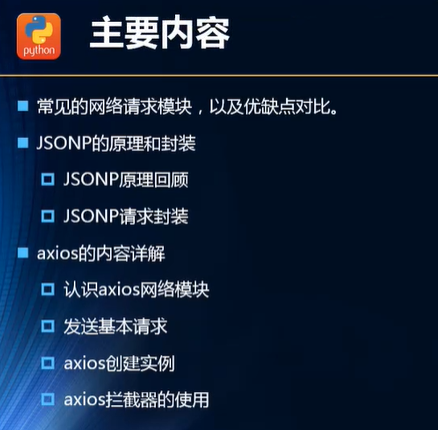
## 2.选择什么网络模块？
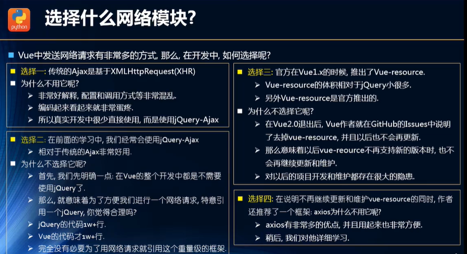

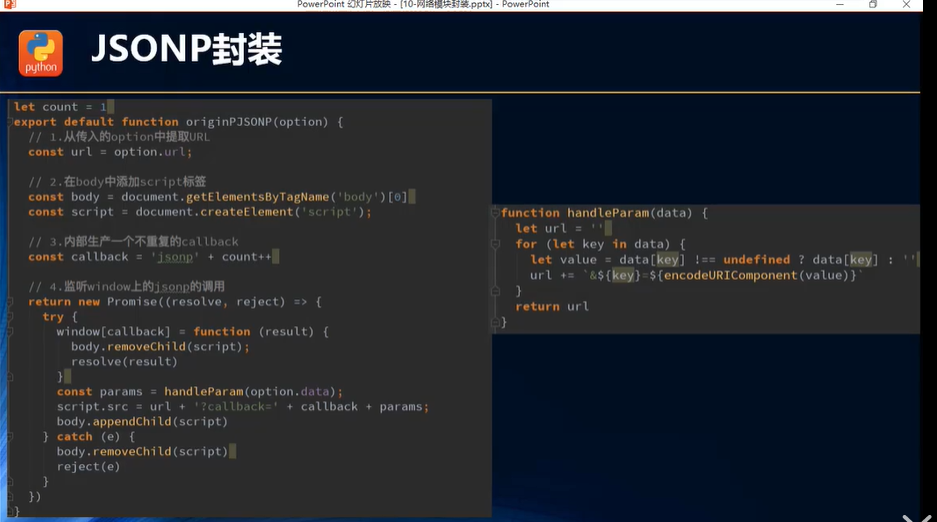

## 3.为什么选择axios?
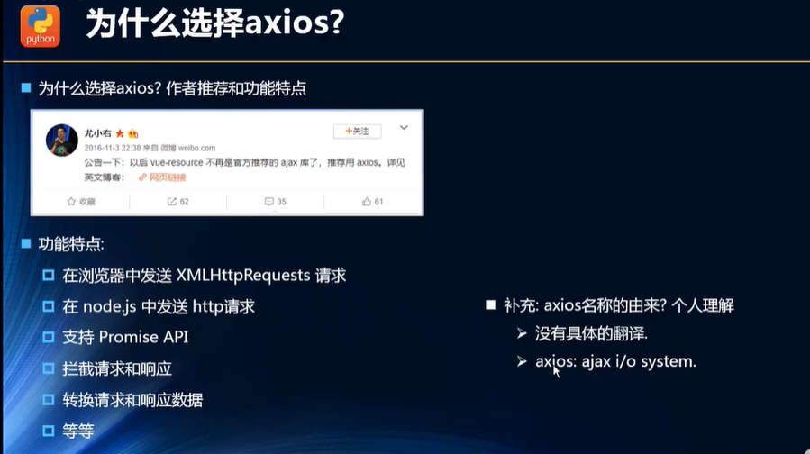

# 2.axios的使用
## 1.支持多种请求方式
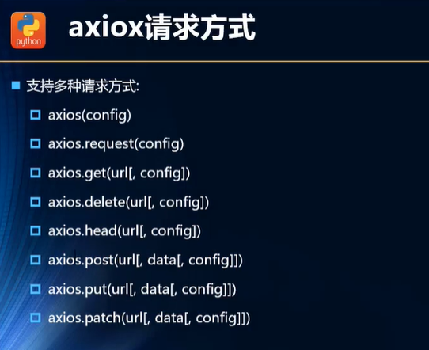

## 3.axios的基本使用
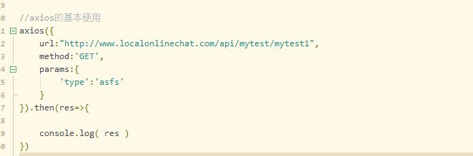

## 2.中文网教程地址
中文网教程地址      http://www.axios-js.com/docs/

## 3.发送get请求
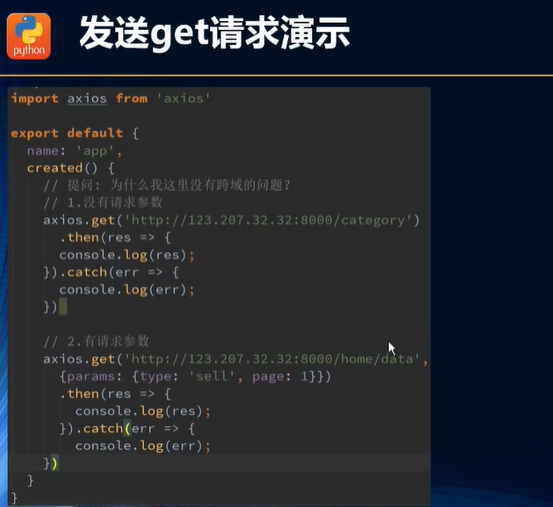

## 4.有一种情况，并发请求，所有请求结束后再执行
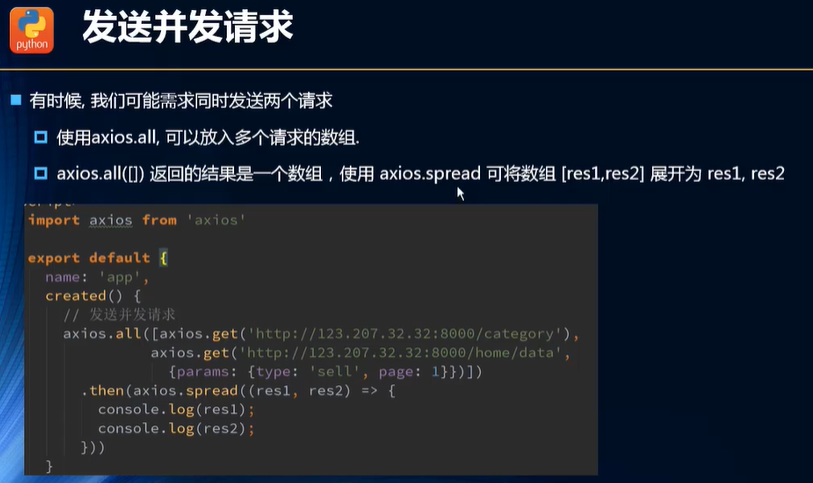
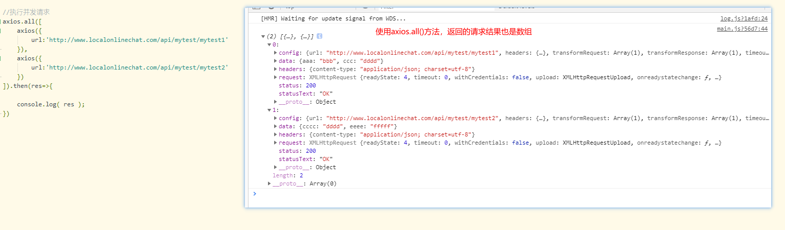

## 6.如果想要将结果展开，使用axios.spread()

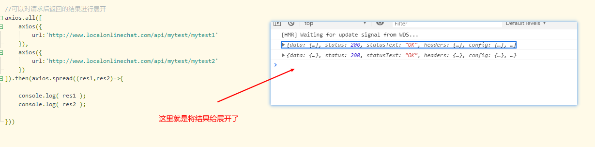

# 3.axios的配置信息相关
## 1.全局配置举例
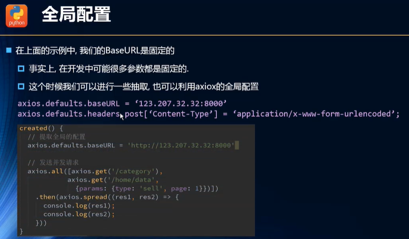
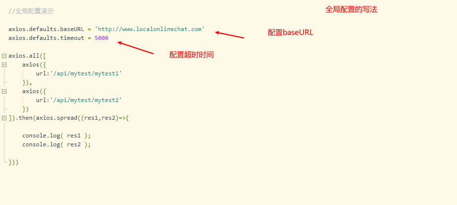

## 2.常见的配置选项
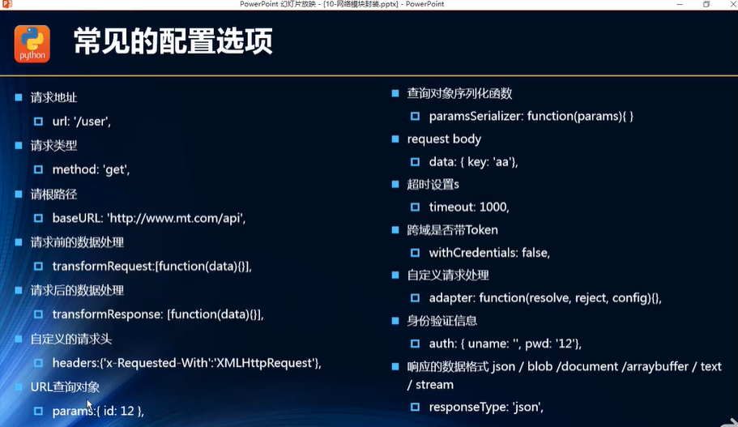

默认请求是get请求，传递参数使用  params
如果是post请求，  传递参数是 data

实践证明,  post方式请求，使用params传参,  后台是获取不到的!

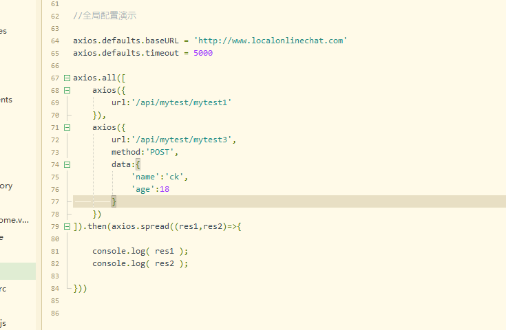

# 4.axios的实例和模块封装

## 1.axios实例的使用
上面介绍的是全局配置。可能在项目中，不止会请求一个url域名，可能会是多个，不同域名请求的baseURL和timeout是不同的
这个时候可以通过 axios的实例来解决

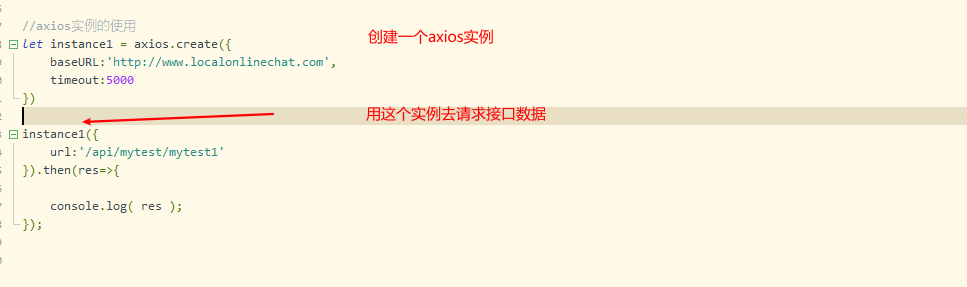

## 2.axios的封装
### 1.第一种封装方式
在src目录下新建network目录，里面创建request.js文件进行封装
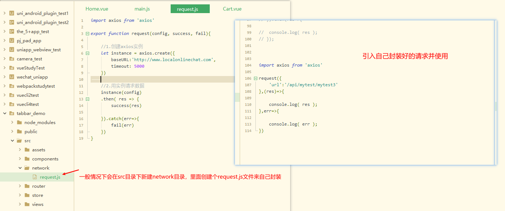

### 2.第2种方式的封装
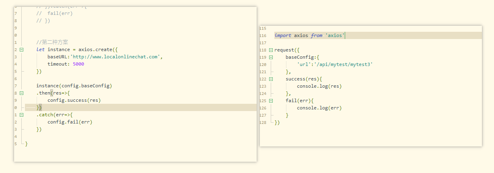

### 3.第3种方式的封装
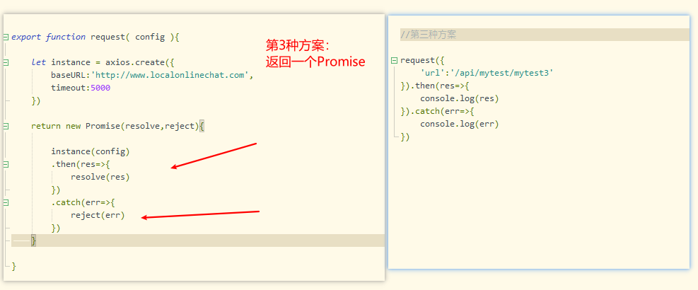

