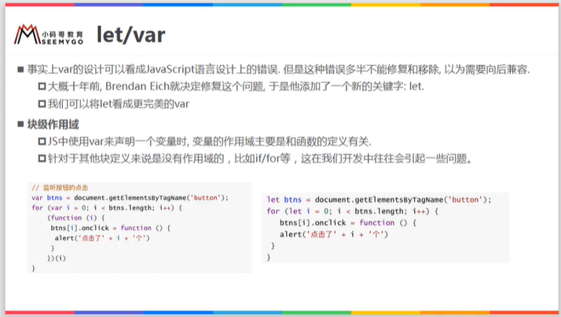
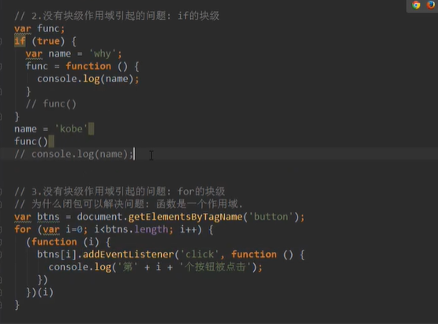
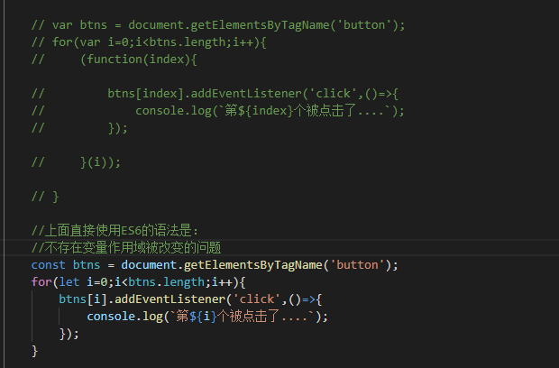
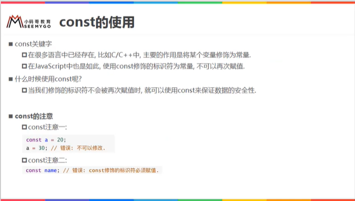
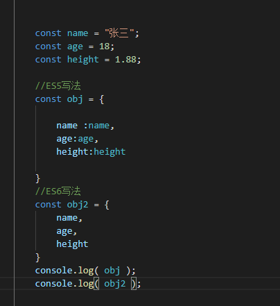

# ES6语法补充
## 1.let/var

1.变量作用域：变量在什么范围内是可用的

2.没有块级作用域引起的问题:

在ES5之前if和for没有块级作用域的概念，所以在很多时候，我们必须要借助于function的作用域来解决应用外面变量的问题。
ES6中加入了块级作用域的概念。

## 2.理解作用域

## 3.const的使用和注意点

1.const是用来定义常量的，不可以被再次赋值!
2.const在定义的时候，就必须要被赋予初始值。
3.const不可以改变指向的对象，但是对象内部的属性是可以改变的。其实指向的是内存地址

## 4.对象字面量的增强写法

## 5.关于缩进的问题
老师建议缩进两个空格，也有的框架是缩进四个空格，但是老师觉得，两个空格更流行，更规范！