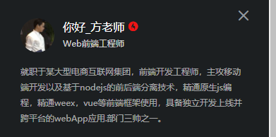

# Weex入门

Weex官网  https://weex.apache.org/zh/
慕课网week入门视频教程地址    https://www.imooc.com/learn/948


## 1.Weex介绍

什么是 Weex ？

1）Weex 是使用流行的 Web 开发体验来开发高性能原生应用的框架。
"Weex" 的发音是 /wiːks/, 和 "Weeks" 同音。

2）Weex 致力于使开发者能基于通用跨平台的 Web 开发语言和开发经验，来构建 Android、iOS 和 Web 应用。简单来说，在集成了 WeexSDK 之后，你可以使用 JavaScript 语言和前端开发经验来开发移动应用。

3）Weex 渲染引擎与 DSL 语法层是分开的，Weex 并不强依赖任何特定的前端框架。目前 Vue.js 和 Rax 这两个前端框架被广泛应用于 Weex 页面开发，同时 Weex 也对这两个前端框架提供了最完善的支持。Weex 的另一个主要目标是跟进流行的 Web 开发技术并将其和原生开发的技术结合，实现开发效率和运行性能的高度统一。在开发阶段，一个 Weex 页面就像开发普通网页一样；在运行时，Weex 页面又充分利用了各种操作系统的原生组件和能力。

*补充：
weex是2016年4月阿里巴巴在Qcon大会上宣布开源的一套跨平台移动开发工具.
对于移动开发者来说，weex主要解决了频繁发版和多端研发的两大痛点，同时解决了前端语言性能差和显示效果受限的问题。
开发者只需要在自己的app中嵌入weex的sdk,就可以通过撰写html,css,javascript来开发native级别的weex界面，weex界面的生成码其实就是一段很小的js,
可以像发布网页一样轻松部署在服务端，然后再app中请求执行。*


### 1.weex的调试工具
weexplayground
        网页版在线调试地址   http://dotwe.org/vue
        android,ios版本下载地址        https://weex.apache.org/zh/guide/playground.html


## 2.安装Weex开发环境

开发环境指南  https://weex.apache.org/zh/guide/develop/setup-develop-environment.html
需要安装相关依赖环境
(1) nodejs
 (2) Weex CLI

### 1.相关命令行
安装依赖  node.js
npm install -g weex-toolkit
weex create project
npm install 
npm run server
npm run dev

在命令行下执行

OSX环境
```
$ sudo chmod -R 777 /usr/local/lib/node_modules/
$ npm i -g weex-toolkit // 安装不要使用sudo执行
$ weex -v // 查看当前weex工具版本
```

Window环境
```
$ npm i -g weex-toolkit 
$ weex -v // 查看当前weex工具版本
```
安装结束后你可以直接使用 weex help 命令验证是否安装成功，它会显示 weex 支持的所有指令，同时，你也可以通过 weex doctor 命令检查你的本地开发环境。

初始化项目
```
$ weex create awesome-project
```

开发
进入项目所在路径，如果你在生成项目的时候选择了自动安装依赖，在进入项目后只需直接运行 npm start 就可以将项目完整跑起来，否则，你需要预先在项目中运行一下 npm install 安装项目所需依赖。


## 3.Weex样式，内建组件。模块和事件介绍
### 1.Weex样式介绍
#### 1)Weex通用样式
**适配和缩略**
1.Weex对于长度值，目前只支持像素值，不支持相对单位(em,rem);适配以750px标准。
2.设定边框：   border目前不支持类似 border:1px solid #FF0000这样的组合写法。
3.设定背景色:  background 目前不支持类似这样 background:red的写法，需要修改为具体 background-color:red
4.定位：    
   1.weex支持position定位, relative | absolute | fixed | sticky,默认值为 relative
   2. weex目前不支持z-index设置元素层级关系，但靠后的元素层级更高，因此，对于层级高的元素，可将其排列在后面。
   3.如果定位元素超过容器边界，在Android下，超出部分将不可见，原因在于Android端元素 overflow默认值为hidden

4.其余需要注意的地方：
    1. weex支持线性渐变linear-grandient, 不支持 radial-gradient径向渐变。
    2. weex中box-shadow仅仅支持ios
    3. 目前<image>组件无法定义一个或几个角的border-radius,只对ios有效，对Android无效。
    4.weex中， flexbox是默认并且唯一的布局模型，每个元素默认拥有display：flex属性。


